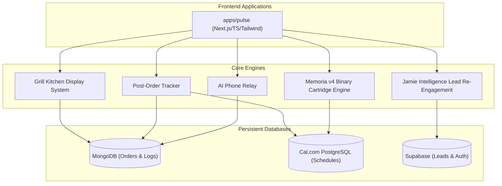

# Sunset Pulse Monorepo

Welcome to **Sunset Pulse**, a premium, high-availability real estate IDX intelligence platform and digital-to-physical portal system. This monorepo consolidates the modern Next.js/TypeScript web interfaces, backend orchestration networks, and localized physical operations, including **Sunset Grill**.

---

## Monorepo Architecture

This workspace is managed as a high-speed, consolidated monorepo:



### Key Folders

* **`apps/pulse`**: The core Next.js application containing the real estate search portal, interactive 3D spatial mapping, Sunset Grill ordering, checkout, tracking, KDS, and phone relay screens/APIs.
* **`packages/`**: Reusable code, core typings, and geographical binary utilities.
* **`cartridges/`**: Compiled binary geographical indices (`.hat` / `.tah`) using the Memoria v4 high-speed layout.

---

## Core Feature Highlights

### 1. 3D Spatial IDX Search (Sunset Pulse Real Estate)

* **Narrative Spatial Flow**: Edge-to-edge interactive Three.js renders mapping live real-estate properties to physical coordinates.
* **High-Speed Geographic Lookups**: Powered by the **Memoria v4 Binary format**, allowing geographical place records to be resolved instantly in `O(1)` from fixed-width 128-byte binary entries.

### 2. High-Performance Sunset Grill & KDS

* **Digital-to-Physical Kitchen Grid**: Customers build structured cart orders for Sunset Grill, check out through Stripe, and send paid orders into MongoDB for the Kitchen Display System (KDS). KDS reads paid active orders only, so unpaid carts and incomplete payment sessions do not appear as kitchen work.
* **Post-Order Tracker**: Located at `/grill/tracker/[orderId]`, a real-time screen showing order progress, estimated wait, and estimated ready time.
* **Cal.com Shift Roster Binding**: Cross-references Cal.com PostgreSQL scheduling tables via Prisma at order creation time to show the active scheduled cook.
* **AI Phone Relay Ordering**: Paid grill orders can be converted into a deterministic employee ticket and a Twilio phone script. The relay does not take conversational orders or interpret vague menu requests; it only reads the structured cart order.
* **Dynamic Pickup Timing**: Grill order wait time is calculated as `max(15 minutes, total item quantity * 4 minutes)` and stored with the order as `estimatedWaitMinutes` and `estimatedReadyAt`.

### 3. Advanced Shift & SMS Dispatch Scheduler

* **Split-Shift Orchestration**: Splits shifts into morning, mid-afternoon, and closing slots with automatic overlapping shift validations.
* **Draft Sandboxing**: Allows admins to construct upcoming weekly draft rosters in sandboxed buffers without altering active live shifts.
* **SMS Drop & Backfill Engine**: Handles late-shift drops via Twilio auto-escalation broadcast and `/api/scheduling/sms/incoming` employee claim replies.
* **Local Prisma Client**: Pulse now owns the minimal Prisma schema it needs at `apps/pulse/prisma/schema.prisma`, with generated client output under `apps/pulse/lib/generated/prisma`. This removes the runtime dependency on the external `@calcom/prisma` workspace package for scheduling routes and tests.

### 4. Jamie Intelligence Agent

* **Lead Re-engagement Hook**: Monitors lead scores in Supabase and formulates personalized SMS and email re-engagement copy on time-decayed prospects.
* **Chat Response Abstraction**: JamieChat routes all visible replies through `apps/pulse/lib/ai/jamieResponse.ts` so tool-call JSON, internal analysis labels, source scores, and worker metadata stay out of the normal user transcript. Dev mode still exposes raw process payloads where needed.

---

## Sunset Grill AI Phone Relay

The phone relay is deterministic in this sprint. Customers order through the normal cart UI, customize items in the cart, and pay before anything is sent to the store. After payment, the system can generate:

* **Employee ticket**: Clean kitchen-facing order format with one line per differently customized item.
* **Phone call script**: A spoken pickup-order script that reads the same structured order to the store.
* **DTMF keypad flow**: Store employee can press `1` to skip to the order, `2` to confirm, or `3` to repeat.

### Burger Customization Rules

* `All the way` is the default for each grill item: pickles, lettuce, onions, tomato.
* Notes such as `no pickles`, `without onions`, `hold tomato`, or `plain` alter the default customization.
* Removed vegetables are omitted from the vegetable line and added to a `Removed:` line.
* If the same item has different customizations, it is split into separate cart/order line items and the phone script labels the group as `made different`.

Example ticket:

```text
ORDER: 2 Cheeseburger Baskets

#1 Cheeseburger Basket
Sauce: Mayo, Mustard
Vegetables: Lettuce, Onions, Tomato
Removed: Pickles

#2 Cheeseburger Basket
Sauce: Mayo
Vegetables: Pickles, Lettuce, Onions, Tomato
```

### Paid-Order Safety Checks

Phone relay should only run after payment is complete:

* `POST /api/orders` creates orders as unpaid and ignores client-supplied payment state.
* `POST /api/orders` resolves cart item IDs against the server menu catalog before pricing, wait-time calculation, and persistence. Browser-supplied item names and prices are not trusted.
* Unavailable or invalid menu item IDs are rejected before an order can be created.
* `GET /api/orders` only returns paid active orders to the KDS.
* The Stripe webhook requires `checkout.session.completed` with `payment_status === "paid"`.
* Duplicate Stripe webhook deliveries do not re-notify staff once an order is already marked paid.
* Real phone relay test calls require an `orderId`; raw item payloads are allowed for `dryRun` template tuning only.
* `dispatchPaidOrderPhoneRelay` rejects unpaid orders before creating a Twilio call.

### Deals and Coupons

The cart supports one deal code per order. Coupon totals are recalculated on the server during order creation and Stripe checkout, so the browser cannot force its own discounted total.

Initial launch codes:

| Code | Behavior |
| :--- | :--- |
| `FREEDRINK` | Reward-only coupon. Adds a free fountain drink note for staff at pickup and does not change the card charge. |
| `SUNSET1` | Takes `$1.00` off the order. |
| `BASKET10` | Takes `10%` off eligible food items, capped at `$5.00`. |

Delivery fees can be marked `discountEligible: false` and are excluded from coupon discount math.

### Stripe Checkout Notes

Grill checkout creates a Stripe Checkout Session from the saved server-side order, not from browser-submitted cart totals. The checkout route omits both `payment_method_types` and `automatic_payment_methods`, allowing Stripe Checkout to use the payment methods enabled in the Stripe Dashboard. This is the current path for Apple Pay and other wallet support.

Subscription checkout follows the same pattern: payment-method selection is left to Stripe Dashboard settings instead of hardcoded in the route.

### Sunset Chat

`/sunset-chat` is the local wall for counter chatter, meetups, lost-and-found, grill notes, and rotating official coupon posts. Public posts are intentionally simple: nickname, tag, message, 240 characters, no profanity filter, and a 48-hour expiration.

Moderation is email-approved. Staff controls are available only when the signed-in user has an approved moderator email or operator/admin access. Official coupon posts are generated from the launch deal definitions and link into `/grill?coupon=CODE`, which applies the coupon to the cart session.

### Environment Variables

Configure these in `apps/pulse/.env.local` or the deployment environment:

```bash
PHONE_RELAY_STORE_PHONE=+1...
PHONE_RELAY_PUBLIC_BASE_URL=https://your-public-callback-host
PHONE_RELAY_TEST_SECRET=replace-with-local-secret
TWILIO_ACCOUNT_SID=...
TWILIO_AUTH_TOKEN=...
TWILIO_FROM_NUMBER=+1... # must be a verified or purchased Twilio number
STRIPE_WEBHOOK_SECRET=...
RESEND_API_KEY=...
ORDER_CONFIRMATION_FROM="Sunset Grill <orders@sunsetpulse.app>"
ORDER_CONFIRMATION_REPLY_TO="your-personal-email@example.com"
ORDER_CONFIRMATION_RTR_ATTACHMENT_PATH=private/legal/rtr.pdf
ORDER_CONFIRMATION_RTR_ATTACHMENT_NAME=RTR.pdf
SUNSET_CHAT_OWNER_EMAIL="your-personal-email@example.com"
SUNSET_CHAT_MODERATOR_EMAILS="cook@example.com,cashier@example.com"
```

### Local Template Testing

Run deterministic unit tests from `apps/pulse`:

```bash
npx vitest run tests/unit/grill-wait-time.test.ts tests/unit/order-relay.test.ts tests/unit/order-relay-dtmf.test.ts tests/unit/grill-notification.test.ts
npm run build
```

Dry-run template tuning can use raw items and does not place a call:

```bash
curl -X POST http://localhost:3001/api/grill/relay/test-call \
  -H "Content-Type: application/json" \
  -H "x-relay-test-secret: $PHONE_RELAY_TEST_SECRET" \
  -d '{"dryRun":true,"items":[{"id":"cheeseburger-basket","name":"Cheeseburger Basket","quantity":1,"customization":{"sauces":["Mayo"],"vegetables":["Pickles","Lettuce","Onions","Tomato"],"allTheWay":true,"removedVegetables":[]}}]}'
```

Real phone tests should use a paid order ID:

```bash
curl -X POST http://localhost:3001/api/grill/relay/test-call \
  -H "Content-Type: application/json" \
  -H "x-relay-test-secret: $PHONE_RELAY_TEST_SECRET" \
  -d '{"dryRun":false,"interactive":true,"orderId":"ORDER_ID","to":"+18179805953"}'
```

### Menu Catalog Updates

The live grill menu is read from MongoDB through `/api/menu`; `apps/pulse/menu.json` is seed material, not the runtime source of truth. Avoid running the full menu seed (`lib/core/seedMenu.mjs`) for one-off production fixes because it deletes and reinserts the whole menu.

The admin menu manager also includes a **Bulk Prices** workflow for pasting line-based price updates such as `Candy Bar 2.79`. It normalizes item names, previews exact or close matches, and applies matched price updates through the existing `/api/menu` PATCH path.

#### Universal Menu Sync (Recommended)

Use the universal upsert script to sync your local `menu.json` changes to the database without destroying existing data. This script uses `findOneAndUpdate` to surgically update existing IDs or insert new ones.

```bash
cd apps/pulse

# Sync the entire menu.json to MongoDB
npm run menu:upsert

# Sync a specific item ID only
npx tsx scripts/upsert-menu.ts <item-id>
```

This workflow ensures that `menu.json` remains the permanent record in source control while the live database receives updates safely.

#### Universal Project Seeding

For fresh environments or bulk data synchronization, use the universal seed tool. This consolidates multiple legacy seed scripts into a single dispatcher that supports specific domains or a full project seed.

```bash
cd apps/pulse

# Seed EVERYTHING (All domains)
npm run seed all

# Seed specific domains only
npm run seed leads       # Jamie Intelligence Leads (Supabase)
npm run seed scythe      # Scythe Registry Patterns (Supabase)
npm run seed menu        # Sunset Grill Menu Catalog (MongoDB)
npm run seed stories     # Tactical Interactive Stories (MongoDB)
npm run seed vibes       # Vibe Dictionary Parameters (MongoDB)
npm run seed properties  # Real Estate Listings (MongoDB)
npm run seed roster      # Grill Shift Roster (Postgres/Prisma)
```

Each seed target uses **upsert** logic where possible, making it safe to run multiple times without creating duplicate records.

---

## Tech Stack & Database Interoperability

The architecture bridges multiple data layers to maximize scalability and write throughput:

| Database | Primary Role | Driver / ORM | Focus |
| :--- | :--- | :--- | :--- |
| **Supabase (PostgreSQL)** | Leads, authentication, global preferences | `@supabase/supabase-js` | Performance and auth integrity |
| **Scheduling PostgreSQL** | Roster schedules, booking, and shift dispatches | Local Pulse Prisma Client | Roster scheduling and SMS webhooks |
| **MongoDB** | Active grill orders, checkout sessions, relay state, and telemetry | Mongoose | High-throughput order logs |
| **Memoria v4 (`.hat`/`.tah`)** | Geographic places database and metadata indexes | Custom Binary Stream Buffer | High-speed spatial lookups |

### Why Prisma Helps Us Move Fast

Prisma turns database schema into usable TypeScript code. Instead of hand-writing SQL every time we need users, bookings, webhooks, schedules, or related records, Prisma reads `schema.prisma` and generates a typed client:

```ts
await prisma.user.findMany()
await prisma.booking.create({ data: bookingData })
await prisma.webhook.update({ where, data })
```

That gives us several speed advantages:

* **One schema becomes many tools**: `schema.prisma` describes models, fields, relations, indexes, and enums. From that, this repo generates Prisma client code, TypeScript types, enum exports such as `TimeUnit.MINUTE`, Zod schemas, and Kysely types.
* **Less hand-written glue**: when we add or change a model, Prisma regenerates the client and related types instead of requiring us to manually update every database access layer.
* **Type safety**: if a field is renamed, removed, or changed, TypeScript can catch broken code before runtime.
* **Database migrations**: Prisma tracks database structure changes as migrations, which keeps schema evolution controlled instead of relying on one-off manual edits.
* **Fast feature scaffolding**: if we need a real `Coupon`, `OrderPayment`, or `PhoneRelayAttempt` table, we define the model once, generate the client, and immediately get typed create/read/update functions.

In this repo, Prisma primarily supports the Cal.com-style scheduling and roster data. Pulse now keeps the scheduling schema local in `apps/pulse/prisma/schema.prisma` and generates the client into `apps/pulse/lib/generated/prisma` during install or with `npm run prisma:generate`. Sunset Grill orders currently use MongoDB/Mongoose, while scheduling routes and roster tests use the local Prisma wrapper at `apps/pulse/lib/core/prisma.ts`.

### Latest Production Hardening

* Ported Pulse scheduling database access away from the external `@calcom/prisma` workspace package and onto a local Prisma schema/client wrapper.
* Added JamieChat response abstraction so internal analysis labels, tool-call payloads, retrieval source scores, and JSON envelopes do not bleed into normal chat replies.
* Added a bulk price import workflow to the admin menu manager for fast line-based menu price updates.
* Removed the duplicate lowercase `TimeUnit` enum from both Prisma schema copies and kept the mapped uppercase enum: `DAY @map("day")`, `HOUR @map("hour")`, and `MINUTE @map("minute")`.
* Added server-side cart sanitization in `apps/pulse/lib/grill/serverCart.ts`.
* Updated `POST /api/orders` to use server-resolved menu item names and prices for pricing, wait time, and saved order items.
* Kept the delivery fee fixed server-side at `$10` and non-discountable.
* Updated Stripe Checkout routes to let Stripe Dashboard settings decide payment methods instead of sending hardcoded payment-method parameters.
* Added regression tests for server-side cart pricing and Stripe Checkout session parameters.

---

## Getting Started

### Local Development

1. **Environment Configuration**:
   Review `.env.local` inside `apps/pulse` to ensure database connection strings, Twilio credentials, Stripe credentials, and relay settings are populated.

2. **Boot the Dev Server**:
   Start the Next.js development server locally:

   ```bash
   npm run pulse:dev
   ```

3. **Compile the Spatial Catalog**:
   Pack current geographic text shards and place coordinate indices into the Memoria v4 binary cartridge:

   ```bash
   npm run tah:pack-master
   ```

### Running Tests

Execute the complete test suites:

```bash
npm run test:unit
```

Run the focused grill relay checks:

```bash
cd apps/pulse
npx vitest run tests/unit/grill-wait-time.test.ts tests/unit/order-relay.test.ts tests/unit/order-relay-dtmf.test.ts tests/unit/grill-notification.test.ts tests/unit/grill-server-cart.test.ts tests/unit/grill-checkout-stripe.test.ts
npm run build
```

---

## Next Sprint Actionables

1. Configure a verified or purchased Twilio caller number and set `PHONE_RELAY_STORE_PHONE` for the real store destination.
2. Expose local callbacks with a public HTTPS tunnel or deployed URL and set `PHONE_RELAY_PUBLIC_BASE_URL`; then test the DTMF flow end to end.
3. Add explicit cart UI controls for `all the way`, individual vegetables, mayo, mustard, and removed toppings so staff-facing scripts do not depend on notes parsing.
4. Persist relay sessions outside in-memory storage and link every relay event to the order audit trail.
5. Add retry and escalation rules for no input, repeated invalid input, Twilio failures, and too many repeat requests.
6. Add KDS/admin controls to manually retry, cancel, or mark a phone relay as handled by a human.
7. Add paid-order integration tests with mocked Stripe webhook events and mocked Twilio calls.
8. Decide whether `Pay at Counter` stays out of KDS until POS confirmation or gets its own separate counter-payment workflow.
9. Tune store-specific phone script pacing, wording, and item grouping after live test calls.
10. Monitor wait-time accuracy and evolve the formula from `max(15, quantity * 4)` to account for item type, queue depth, and kitchen staffing.

---

## Production Data Safety

Production destructive database actions must be treated as a backup-first workflow. Guarded destructive code paths require all of the following before they can run in production:

```bash
ALLOW_PRODUCTION_DESTRUCTIVE_DB_ACTIONS=true
CONFIRM_PRODUCTION_DESTRUCTIVE_ACTION=I_UNDERSTAND_THIS_CAN_DELETE_PRODUCTION_DATA
PRODUCTION_BACKUP_REFERENCE=mongodb-snapshot-or-backup-id
PRODUCTION_BACKUP_COMPLETED_AT=2026-06-07T18:30:00.000Z
```

The backup timestamp must be a valid ISO timestamp and less than 24 hours old. Test-only endpoints are disabled in production unless `ENABLE_TEST_ENDPOINTS_IN_PRODUCTION=true` is explicitly set.
