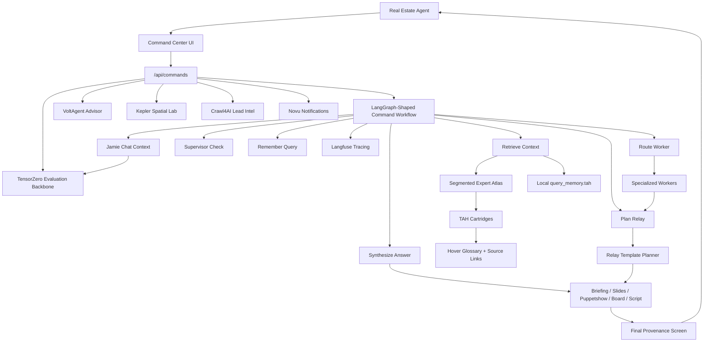

# Sunset Pulse

Sunset Pulse is a real estate agent command center powered by local TAH intelligence.

It is built around a simple thesis: agents should not have to send every workflow to one giant model. Sunset Pulse turns real estate knowledge into compact `.tah` command files, routes narrow commands to specialized workers, and remembers useful context locally so future queries cost fewer tokens.

## What It Does

- Lets agents command specialized AI workers instead of chatting with one generic model.
- Uses `.tah` cartridges as the primary structured context layer.
- Packs large knowledge libraries into a segmented 400-expert atlas for fast retrieval.
- Routes commands through real estate workers such as Lead Scoring, Follow-Up Writer, Neighborhood Explainer, Comp Analysis, Local Commerce, Agent Voice, and Supervisor Check.
- Runs the Command Center workflow as a LangGraph-shaped graph with named stages for routing, retrieval, planning, synthesis, supervision, memory, and response assembly.
- Supports delivery modes: briefing, slideshow, puppetshow, field-board, and script.
- Adds a final provenance screen to every relay explaining where the information came from and what the user learned.
- Saves local query memory to `query_memory.tah` so repeated work can reuse local context.
- Links dense terms and acronyms to hover definitions sourced from local `.tah` cartridges.
- Shares Command Center context with Jamie so chat answers can use the same private helper layer.
- Traces Command Center graph execution with Langfuse when Langfuse environment variables are configured.

## Current Release

Current local release: **v0.2.0 - TAH Command Center**

Release notes:

- [CHANGELOG.md](CHANGELOG.md)
- [apps/pulse/docs/releases/v0.2.0-tah-command-center.md](apps/pulse/docs/releases/v0.2.0-tah-command-center.md)

Recent local additions:

- WIP SaaS agent-site foundation turns Sunset Pulse into a swappable public website layer for individual sales agents.
- Tenant routing supports clean agent subdomains such as `agent.sunsetpulse.app`, backed by agent profiles instead of hardcoded Taz Realty copy.
- Agent profiles now carry branding, assistant, compliance, and integration settings for per-agent site generation.
- Public agent homepages can render image-backed MLS hot-list listings instead of dummy property cards.
- Agent-site listing detail pages keep users inside the agent-branded shell at `/properties/:id`.
- Command Center helper selection now uses a professional arena-style UI with imported ClaudeCraft assets.
- Command Center routing now runs through a LangGraph-shaped stage graph instead of one flat router function.
- Langfuse observability traces the Command Center graph and each stage with redacted, structured metadata.
- Command Post details now collapse into the answer view instead of dominating the page.
- Command Post access checks deny public development hosts and production localhost spoofing.
- MarkItDown document import can convert source files into TAH-ready local cartridges.
- LanceDB local full-text search can index `.tah` cartridges for retrieval experiments.
- Kepler.gl Spatial Lab maps listing signals with interactive geospatial filters and layers.
- deck.gl native signal maps add app-specific geospatial layers alongside the Kepler workbench.
- VoltAgent adds a typed Command Center advisor with route, loadout, and roster tools.
- SQLSync-ready command mutations stage query memory and action clicks into a local JSONL journal.
- TensorZero-ready workflow evaluation and feedback records score Command Center runs, capture useful operator behavior, and route JamieChat through a model-routing backbone.
- assistant-ui powers a maximized JamieChat workspace at `/jamie-chat` beside the Command Center.
- Crawl4AI adds an operator-guarded lead intelligence crawler for approved regional sites, brokerages, and public-record pages, with optional TAH cartridge import.
- Novu adds a unified notification workflow trigger and local audit ledger for lead alerts and future staff/client messaging.
- Sunset Chat can hand a note-writing request into Command Center without pre-filling messy input text.
- Jamie chat routes now share the Command Center helper context through `/api/jamie/chat`.
- TAH glossary terms such as `CCS`, `PENDING`, `Service Request`, `TREC`, `MLS`, `IDX`, and `pgvector` show hover definitions.
- Glossary terms can semantically link back to source cartridges, such as `dallas_community_intel.tah` through `/tah/dallas-community-intel`.

## SaaS Agent Sites - WIP

Sunset Pulse is being expanded from a single-agent command center into a repeatable SaaS website layer for real estate sales agents. The goal is that a new agent can get a clean public site, branded assistant, MLS-backed listing surface, and lead path without cloning or rewriting the app.

Planned public URL shape:

```text
{agent}.sunsetpulse.app
{agent}.sunsetpulse.app/properties/{mlsId}
```

Current WIP features:

- **Swappable agent profiles**: each site can load agent name, brokerage, license, markets, contact info, headshot, assistant name, and compliance copy from profile data.
- **Subdomain tenant routing**: tenant routes are being shaped around clean subdomains such as `taz.sunsetpulse.app` or future custom agent subdomains.
- **Stripped public website shell**: public agent sites remove internal Command Center, dev controls, lab tools, and Taz-specific copy so the page feels like the agent's own consumer site.
- **MLS hot-list publishing**: agent profiles can carry curated MLS IDs for featured homes, starting with Tour Studio / hot-list listings.
- **Image-backed listing rule**: public featured cards are filtered to active MLS-style listings with usable remote images so the homepage never opens with blank dummy property cards.
- **Agent-branded property detail pages**: listing cards route to `/properties/:id` inside the same tenant shell, with listing photos, price, beds, baths, square footage, notes, highlights, agent CTA, and MLS disclaimer.
- **Lead routing per agent**: contact links prefer the profile's lead email, with fallback to the agent email and phone.
- **Compliance profiles**: MLS disclaimers, footer disclaimers, jurisdiction, and equal-housing style settings are moving into per-agent profile fields.
- **Assistant profile separation**: Jamie can be renamed or repositioned per agent while still using the same shared assistant infrastructure.
- **Supabase-backed profile fields**: site configuration now has JSON profile slots for agent, assistant, compliance, and integrations.
- **Migration and seed tooling**: profile migrations and an upsert script exist so default and future agent profiles can be inserted without hand-editing rows.

Near-term SaaS backlog:

- Build an admin flow for creating/editing agent profiles without touching SQL.
- Add custom-domain mapping once the subdomain flow is stable.
- Add per-agent listing source controls for MLS provider, hot-list IDs, and default market filters.
- Add per-agent lead capture forms instead of relying only on `mailto:` and `tel:` CTAs.
- Add branded OG images and SEO metadata per agent/listing.
- Add a profile completeness checker so an agent site cannot publish with missing contact, compliance, or image-backed listing data.
- Add visual QA for `/{agent}` and `/properties/{mlsId}` routes before pushing.
- Add billing/package flags for SaaS tiers once the product surface settles.

## Monorepo Layout

```text
SunsetPulse/
  apps/
    pulse/                  Next.js app for Sunset Pulse
      app/command-center/   Agent command center route
      app/jamie-chat/       Maximized assistant-ui Jamie workspace
      app/api/commands/     Command router API
      app/api/agents/       AI agent framework endpoints
      app/api/sqlsync/      SQLSync-ready mutation snapshots
      app/api/tensorzero/   TensorZero evaluation and JamieChat snapshots
      app/api/kepler/       Kepler.gl dataset feeds
      app/api/intelligence/ Lead intelligence ingestion APIs
      app/api/notifications/ Novu notification workflow APIs
      app/api/jamie/chat/   Jamie chat alias wired to the shared helper route
      app/api/tah/          TAH catalog, fact, forge, and search APIs
      cartridges/           Local TAH inputs and generated archives
      components/           UI components
      components/glossary/  Shared hover/link glossary renderer
      docs/                 Pulse-specific docs
      lib/command-center/   Workers, router, synonyms, relay templates, query memory
      lib/agents/           VoltAgent and agent-framework adapters
      lib/core/             TAH, Memoria, atlas, and orchestration primitives
      lib/glossary/         Site glossary terms mapped to TAH source cartridges
      lib/observability/    Langfuse tracing helpers
      lib/sqlsync/          SQLSync-ready mutation journal helpers
      lib/tensorzero/       TensorZero-ready evaluation ledgers
      lib/lead-intel/       Crawl4AI lead intelligence ledger helpers
      lib/notifications/    Novu notification workflow helpers
      scripts/              TAH import, packing, and local index utilities
      tensorzero/            TensorZero gateway config stubs
      workers/lead-intel-crawler/
                              Optional Python Crawl4AI worker
  packages/                 Shared workspace packages
  assets/                   Static and generated assets
```

## Architecture



## Integration Roadmap

The current five-project integration sequence is:

1. **deck.gl** - app-native WebGL layers for listing, lead, market, and TAH place signals.
2. **VoltAgent** - TypeScript agent runtime for typed Command Center advisor tools.
3. **SQLSync** - local-first sync contract for durable offline query memory and operator state.
4. **TensorZero** - model gateway, workflow evaluation, and experiment loops for AI routing.
5. **OpenLIT** - OpenTelemetry-native AI and infrastructure observability.

Status:

- deck.gl: started with `/spatial-lab/deck`.
- VoltAgent: started with `/api/agents/voltagent/command-advisor` and Command Center trace integration.
- SQLSync: started with `/api/sqlsync/command-journal` and staged Command Center memory mutations.
- TensorZero: started with `/api/tensorzero/command-evals`, `/api/tensorzero/jamie-chat`, local workflow-eval ledgers, and `apps/pulse/tensorzero/tensorzero.toml`.
- OpenLIT: queued for research and implementation passes.

Stack docs:

- [apps/pulse/docs/AI_INTEGRATION_STACK.md](apps/pulse/docs/AI_INTEGRATION_STACK.md)

## TAH Intelligence Layer

TAH files are compact knowledge capsules. The command center currently includes first-party capsules such as:

- `agent_brand.tah`
- `lead_history.tah`
- `listing_context.tah`
- `neighborhood_context.tah`
- `comps_context.tah`
- `objection_scripts.tah`
- `local_business_context.tah`
- `market_rules.tah`

The app can also pack many local and upstream cartridges into:

```text
apps/pulse/cartridges/expert-atlas/segmented_expert_atlas.hat
apps/pulse/cartridges/expert-atlas/segmented_expert_atlas.tah
```

The expert atlas uses segmented metadata so retrieval can start near the middle of the index and quickly reject irrelevant shards by domain, complexity, density, vitality, and concept links.

## Command Center

Route:

```text
/command-center
```

API:

```text
GET  /api/commands     # relay template and format catalog
POST /api/commands     # route a command through worker + TAH retrieval
```

Jamie route alias:

```text
POST /api/jamie/chat   # same Jamie response path with Command Center helper context
```

Example request:

```bash
curl -X POST http://127.0.0.1:3002/api/commands \
  -H "Content-Type: application/json" \
  -d "{\"command\":\"Explain the community and nearby shops\",\"relayMode\":\"slideshow\",\"supervisor\":true}"
```

Supported `relayMode` values:

- `briefing`
- `slideshow`
- `puppetshow`
- `field-board`
- `script`

## LangGraph-Shaped Workflow

The Command Center router now runs as a LangGraph-shaped graph instead of one flat function. The graph makes each stage observable and easier to test:

- `route` chooses the worker and route mode.
- `retrieve` recalls local query memory and pulls TAH context from the segmented expert atlas.
- `plan` selects the relay template and delivery format.
- `synthesize` builds the agent-ready answer.
- `supervise` adds optional guardrail notes.
- `remember` writes compact query memory.
- `respond` assembles the final API response and trace payload.

Implementation:

```text
apps/pulse/lib/command-center/commandRouter.ts
apps/pulse/lib/compat/langgraphLinear.ts
```

The local adapter implements the small linear graph subset this workflow uses. It exists because the current `@langchain/langgraph` package barrel triggers a Next production-build export issue; the adapter can be removed once the upstream package path is stable for this app.

## Command Post

Command Center includes a compact Command Post disclosure that links the generated answer back to the local operator console without overwhelming the primary result.

Command Post surfaces:

- operator console endpoint,
- access mode and access-denied reasons,
- master archive readiness,
- pending terminal intent count,
- command router modes,
- `/status` probe results.

Access rules are intentionally strict:

- production requests cannot bypass protection by sending a localhost `Host` header,
- public development hosts require authorization,
- local/operator access can still use the console for guarded workflows.

Implementation:

```text
apps/pulse/components/command-center/AgentSelectionArena.tsx
apps/pulse/lib/core/operator_access.ts
apps/pulse/lib/core/routeAuth.ts
apps/pulse/app/api/admin/orchestrator/
```

## VoltAgent Advisor

Sunset Pulse includes a VoltAgent-powered Command Center advisor. It is wired as a typed agent layer beside the existing Command Center workflow, not as a replacement.

Routes:

```text
GET  /api/agents/voltagent/command-advisor   # advisor status and tool list
POST /api/agents/voltagent/command-advisor   # run the advisor directly
POST /api/commands                           # includes trace.voltagent on command runs
```

Current tools:

- `route_command` chooses the best Command Center worker.
- `list_worker_loadout` returns that worker's TAH files and command-fit signals.
- `summarize_command_center` reports worker, slot, and file coverage.

By default, the advisor stays in standby if its provider credential is missing. It still records the route, model, tool list, and reason in the Command Post panel. To enable model-backed notes:

```bash
VOLTAGENT_COMMAND_MODEL=groq/llama-3.1-8b-instant
GROQ_API_KEY=your_groq_key_here
```

You can force standby mode:

```bash
VOLTAGENT_COMMAND_ADVISOR_ENABLED=false
```

Implementation:

```text
apps/pulse/lib/agents/voltagentCommandAdvisor.ts
apps/pulse/app/api/agents/voltagent/command-advisor/route.ts
apps/pulse/app/api/commands/route.ts
apps/pulse/components/command-center/AgentSelectionArena.tsx
```

## Relay Templates

Relay templates tell the robot how to explain what it learned from TAH files.

The catalog currently contains **68 content templates** and **5 delivery formats**.

Docs:

- [apps/pulse/docs/TAH_RELAY_TEMPLATE_CATALOG.md](apps/pulse/docs/TAH_RELAY_TEMPLATE_CATALOG.md)

Every relay plan includes:

- selected content template,
- delivery format,
- visual motif and layout,
- wording guidance,
- section instructions,
- source anchors,
- final provenance screen.

## Semantic Glossary

Sunset Pulse renders common acronyms and domain terms as hoverable glossary terms on knowledge-heavy surfaces.

Current glossary behavior:

- shows a short definition on hover or keyboard focus,
- keeps the visible text unchanged,
- stores the source `.tah` file on the term,
- links known terms to their cartridge page when available.

Examples:

- `CCS` links to `dallas_community_intel.tah` through `/tah/dallas-community-intel`.
- `PENDING` explains that the request is received but not closed.
- `Service Request` explains the city tracking record behind a 311 item.
- `TREC`, `MLS`, `IDX`, `TAH`, and `pgvector` link to their relevant knowledge cartridges.

Glossary implementation:

```text
apps/pulse/lib/glossary/siteGlossary.ts
apps/pulse/components/glossary/GlossaryText.tsx
```

Glossary-aware surfaces currently include:

- Command Center answers and source excerpts,
- TAH cartridge pages,
- TAH library and master-search results,
- Jamie chat messages.

## Local Query Memory

Sunset Pulse saves compact local memory records after command-center queries:

```text
apps/pulse/cartridges/query_memory.tah
```

This file is intentionally ignored by Git. It stays local to the user machine.

What gets saved:

- command,
- intent,
- worker,
- relay template and mode,
- source TAH files used,
- top concepts,
- learned recap,
- summary and actions.
- SQLSync-ready mutation rows for query memory and clicked command actions.

Docs:

- [apps/pulse/docs/TAH_QUERY_MEMORY.md](apps/pulse/docs/TAH_QUERY_MEMORY.md)

Disable query memory:

```bash
PULSE_QUERY_MEMORY_DISABLED=true
```

Use a custom memory path:

```bash
PULSE_QUERY_MEMORY_PATH=C:\path\to\query_memory.tah
```

## SQLSync Journal

Sunset Pulse now stages Command Center state changes into a SQLSync-ready local mutation journal. This is the app-side contract we can hand to a future SQLSync reducer/coordinator without changing the Command Center write path later.

Route:

```text
GET /api/sqlsync/command-journal
```

Current reducer contract:

- `upsert_command_query_memory`
- `upsert_command_action_memory`

Default journal path:

```text
apps/pulse/cartridges/sqlsync/command-journal.sqlsync.jsonl
```

Configure:

```bash
PULSE_SQLSYNC_CLIENT_ID=sunset-pulse-local
PULSE_SQLSYNC_JOURNAL_DISABLED=false
PULSE_SQLSYNC_JOURNAL_PATH=C:\path\to\command-journal.sqlsync.jsonl
```

Implementation:

```text
apps/pulse/lib/sqlsync/commandJournal.ts
apps/pulse/app/api/sqlsync/command-journal/route.ts
apps/pulse/lib/command-center/queryMemory.ts
```

## TensorZero Evaluations, Feedback, And JamieChat

Sunset Pulse now records TensorZero-ready workflow evaluation rows and feedback rows for Command Center runs. JamieChat also routes every `/api/chat` turn through `runTensorZeroJamieChat`, records it as a `jamie_chat` function episode, and returns backbone metadata before traffic is moved through a live TensorZero Gateway.

Routes:

```text
GET /api/tensorzero/command-evals
GET /api/tensorzero/jamie-chat
GET /api/tensorzero/feedback
POST /api/tensorzero/feedback
```

Current functions:

```text
sunset_command_center
jamie_chat
```

Current metrics:

- `command_center_quality`
- `command_center_grounded`
- `command_center_actionable`
- `command_center_safety`
- `command_center_usefulness`
- `command_center_actionability`
- `command_center_routing_correction`
- `command_center_needs_improvement`
- `jamie_response_quality`
- `jamie_tool_success`
- `jamie_property_grounding`
- `jamie_conversation_safety`

Feedback sources:

- copying the final answer records usefulness,
- clicking an action tile records actionability,
- manually changing helper after a result records a routing correction,
- re-running a command records a needs-improvement signal.

Default ledger path:

```text
apps/pulse/cartridges/tensorzero/command-evaluations.tensorzero.jsonl
apps/pulse/cartridges/tensorzero/command-feedback.tensorzero.jsonl
apps/pulse/cartridges/tensorzero/jamie-chat.tensorzero.jsonl
```

TensorZero config stub:

```text
apps/pulse/tensorzero/tensorzero.toml
```

Configure:

```bash
TENSORZERO_PROJECT_NAME=sunset-pulse
TENSORZERO_GATEWAY_URL=
TENSORZERO_COMMAND_EVAL_DISABLED=false
TENSORZERO_COMMAND_EVAL_PATH=C:\path\to\command-evaluations.tensorzero.jsonl
TENSORZERO_FEEDBACK_DISABLED=false
TENSORZERO_FEEDBACK_PATH=C:\path\to\command-feedback.tensorzero.jsonl
TENSORZERO_JAMIE_CHAT_DISABLED=false
TENSORZERO_JAMIE_CHAT_PATH=C:\path\to\jamie-chat.tensorzero.jsonl
```

The local ledgers store compact workflow evaluation metadata, metrics, and operator feedback. They avoid raw command or chat text by storing ids, fingerprints, counts, route metadata, variant names, tool names, grounding flags, and metric scores. When a TensorZero Gateway is running, these rows can map to workflow evaluation runs, inference variants, and episode-level feedback.

Implementation:

```text
apps/pulse/lib/tensorzero/commandEvaluation.ts
apps/pulse/lib/tensorzero/feedback.ts
apps/pulse/lib/tensorzero/jamieBackbone.ts
apps/pulse/lib/tensorzero/jamieChat.ts
apps/pulse/app/api/tensorzero/command-evals/route.ts
apps/pulse/app/api/tensorzero/jamie-chat/route.ts
apps/pulse/app/api/tensorzero/feedback/route.ts
apps/pulse/app/api/commands/route.ts
apps/pulse/app/api/commands/actions/route.ts
apps/pulse/app/api/chat/route.ts
apps/pulse/components/command-center/AgentSelectionArena.tsx
apps/pulse/components/JamieChat.tsx
```

## Crawl4AI Lead Intelligence

Sunset Pulse includes a local-first Crawl4AI ingestion route for lead intelligence. It is meant for approved regional sites, brokerage pages, public records, and business profile pages that should become structured context for future lead scoring and Command Center workflows.

Routes:

```text
GET  /api/intelligence/crawl-lead
POST /api/intelligence/crawl-lead
```

The route is operator-guarded and uses an allowlist before a page is crawled. Pass `importToTah: true` to write a readable `.source.md` audit file and a forged binary indexed `.tah` cartridge. By default, rows are appended to:

```text
apps/pulse/cartridges/lead-intel/crawl-results.jsonl
```

Default imported cartridge directory:

```text
apps/pulse/cartridges/imports/lead-intel/
```

For a concept such as `lead_intel_records_example_com_property_record_123`, the importer writes:

```text
lead_intel_records_example_com_property_record_123.source.md
lead_intel_records_example_com_property_record_123.tah
```

Install the optional local worker from `apps/pulse`:

```bash
python -m pip install -r workers/lead-intel-crawler/requirements.txt
python -m playwright install chromium
```

Configure:

```bash
LEAD_INTEL_CRAWLER_DISABLED=false
LEAD_INTEL_ALLOWED_DOMAINS=example.com
LEAD_INTEL_ALLOW_UNLISTED=false
LEAD_INTEL_TRUST_REQUEST_ALLOWLIST=false
LEAD_INTEL_PYTHON=python
LEAD_INTEL_WORKER_PATH=
LEAD_INTEL_LEDGER_PATH=C:\path\to\crawl-results.jsonl
```

Implementation:

```text
apps/pulse/lib/lead-intel/crawlLead.ts
apps/pulse/app/api/intelligence/crawl-lead/route.ts
apps/pulse/workers/lead-intel-crawler/crawl4ai_worker.py
```

## Novu Notification Pipeline

Sunset Pulse includes a Novu-compatible notification workflow layer. It lets the app trigger named notification workflows for lead alerts, staff operations, scheduling updates, and future in-app messages through one contract instead of scattering channel-specific calls everywhere.

Routes:

```text
GET  /api/notifications/novu
POST /api/notifications/novu
```

The route is operator-guarded. If `NOVU_SECRET_KEY` is missing, triggers are recorded locally as `queued_local` so workflows can be developed and audited before connecting Novu Cloud or a self-hosted Novu instance.

Default ledger:

```text
apps/pulse/cartridges/notifications/novu-events.jsonl
```

Configure:

```bash
NOVU_SECRET_KEY=
NOVU_API_URL=https://api.novu.co
NOVU_NOTIFICATIONS_DISABLED=false
NOVU_LEDGER_DISABLED=false
NOVU_LEDGER_PATH=C:\path\to\novu-events.jsonl
NOVU_HOT_LEAD_WORKFLOW_ID=lead-hot-alert
NOVU_OPERATOR_SUBSCRIBER_ID=sunset-operator
NOVU_OPERATOR_EMAIL=operator@example.com
NOVU_OPERATOR_PHONE=+15551234567
```

Implementation:

```text
apps/pulse/lib/notifications/novu.ts
apps/pulse/app/api/notifications/novu/route.ts
apps/pulse/lib/intelligence/leadProcessor.ts
```

## Langfuse Observability

Sunset Pulse can trace Command Center graph runs to Langfuse. Tracing is disabled by default and turns on only when both Langfuse keys are present in the server environment.

Each command creates a root `command-center.graph` agent trace with nested observations:

- `command-center.route`
- `command-center.retrieve`
- `command-center.plan`
- `command-center.synthesize`
- `command-center.supervise`
- `command-center.remember`
- `command-center.respond`

The trace payloads are deliberately conservative. They include worker IDs, route modes, relay modes, shard counts, confidence, action counts, frame counts, memory status, and atlas diagnostics. They avoid copying raw command text, retrieved excerpts, generated copy, tokens, secrets, or long source content into Langfuse.

Configure Langfuse:

```bash
LANGFUSE_PUBLIC_KEY=pk-lf-your-public-key
LANGFUSE_SECRET_KEY=sk-lf-your-secret-key
LANGFUSE_BASE_URL=https://us.cloud.langfuse.com
LANGFUSE_TRACING_ENVIRONMENT=development
LANGFUSE_RELEASE=local
```

Implementation:

```text
apps/pulse/lib/observability/langfuseTracing.ts
apps/pulse/app/api/commands/route.ts
```

## Kepler Spatial Lab

Sunset Pulse includes a Kepler.gl workspace for interactive geospatial analysis of listing and market signals.

Route:

```text
/spatial-lab
```

Dataset API:

```text
GET /api/kepler/listings?limit=140
```

The first dataset uses the existing mock Repliers listing feed and exposes map-ready rows with:

- latitude and longitude,
- list price, original price, estimate, and price deltas,
- days on market,
- beds, baths, square footage, year built, and lot size,
- image quality and photo count,
- status, property type, city, state, neighborhood, and brokerage.

The Kepler page is intentionally isolated from the existing Explorer Map. It uses its own Redux store, loads only on the client, and includes a React 19 compatibility shim for Kepler's legacy sortable control dependency.

Implementation:

```text
apps/pulse/app/spatial-lab/page.tsx
apps/pulse/components/spatial/KeplerSpatialLabLoader.tsx
apps/pulse/components/spatial/KeplerSpatialLab.tsx
apps/pulse/app/api/kepler/listings/route.ts
apps/pulse/lib/compat/reactSortableHoc.tsx
```

## deck.gl Signal Map

The deck.gl signal map is the product-native counterpart to Kepler. It uses the same listing dataset feed but renders controlled layers we can turn into first-class Sunset Pulse features.

Route:

```text
/spatial-lab/deck
```

Current layers:

- listing signal points colored by market state,
- price-weighted heatmap,
- radius scaled by days on market,
- hover card with price, DOM, bed/bath, and image-quality context.

Implementation:

```text
apps/pulse/app/spatial-lab/deck/page.tsx
apps/pulse/components/spatial/DeckListingSignalsLoader.tsx
apps/pulse/components/spatial/DeckListingSignals.tsx
```

## Getting Started

Install dependencies:

```bash
npm install
```

Run the Pulse app:

```bash
npm run pulse:dev
```

Or from the app workspace:

```bash
cd apps/pulse
npm run dev
```

Open:

```text
http://127.0.0.1:3000/command-center
```

If another dev server is already running, Next.js may choose another port such as `3002`.

## Useful Scripts

From the repo root:

```bash
npm run pulse:dev
npm run pulse:build
npm run test:unit
npm run test:e2e
```

From `apps/pulse`:

```bash
npm run tah:import-doc -- -- ./path/to/source.pdf --title "Imported Source"
npm run tah:lancedb:index
npm run tah:lancedb:search -- --query "pricing comps"
npm run lead:intel:crawl -- --url https://example.com --mode both --hints "{}"
npm run tah:pack-expert-atlas
npm run tah:pack-master
npm run test:unit
npm run build
```

## Import Documents Into TAH

Sunset Pulse can use Microsoft MarkItDown to turn local documents into TAH-ready Markdown cartridges. This is useful for MLS PDFs, TREC forms, market reports, seller notes, spreadsheets, slide decks, and other source files that should become local Command Center context.

Install the optional Python dependency once:

```bash
python -m pip install -r apps/pulse/requirements-markitdown.txt
```

Import a document from the repo root:

```bash
npm run tah:import-doc -- -- "C:\path\to\market-report.pdf" --title "Market Report" --aliases "market, comps, pricing"
```

By default, imported cartridges are written under:

```text
apps/pulse/cartridges/imports/
```

Generated `.tah` imports stay ignored by Git unless intentionally unignored.

## Local LanceDB TAH Search

Sunset Pulse can build a local LanceDB full-text index over `.tah` cartridges for fast BM25 retrieval experiments before routing deeper into Command Center.

Build or rebuild the local index:

```bash
npm run tah:lancedb:index
```

Search it:

```bash
npm run tah:lancedb:search -- --query "seller pricing comps"
```

The default database lives at:

```text
apps/pulse/.lancedb/
```

That directory is ignored by Git because it is a generated local index. The index currently uses LanceDB full-text search; vector/hybrid embeddings can be added once the chunking shape is proven.

## Verification

Common local checks:

```bash
npx tsc -p apps/pulse/tsconfig.json --noEmit --pretty false
npm run tah:pack-expert-atlas --workspace=apps/pulse
```

Smoke-test the command route:

```bash
curl -X POST http://127.0.0.1:3002/api/commands \
  -H "Content-Type: application/json" \
  -d "{\"command\":\"Give me a valuation using recent sales\",\"relayMode\":\"slideshow\",\"supervisor\":true}"
```

## Important Docs

- [apps/pulse/docs/TAH_RELAY_TEMPLATE_CATALOG.md](apps/pulse/docs/TAH_RELAY_TEMPLATE_CATALOG.md)
- [apps/pulse/docs/TAH_QUERY_MEMORY.md](apps/pulse/docs/TAH_QUERY_MEMORY.md)
- [apps/pulse/docs/CMS_USB_BRIDGE.md](apps/pulse/docs/CMS_USB_BRIDGE.md)
- [apps/pulse/docs/LOCAL_NEWS_SIGNALS.md](apps/pulse/docs/LOCAL_NEWS_SIGNALS.md)

## Notes On Generated Files

The repo ignores broad `.tah` and `.hat` generated files by default. The first-party command-center capsules are explicitly unignored in `.gitignore` so they can travel with the app.

Generated or local-only artifacts should remain untracked:

- `apps/pulse/cartridges/query_memory.tah`
- `apps/pulse/cartridges/expert-atlas/segmented_expert_atlas.hat`
- `apps/pulse/cartridges/expert-atlas/segmented_expert_atlas.tah`

## Status

This is a local-first, practical implementation. The system is designed to work with cheap/small models and private `.tah` context before adding heavier agent frameworks or vector infrastructure.
