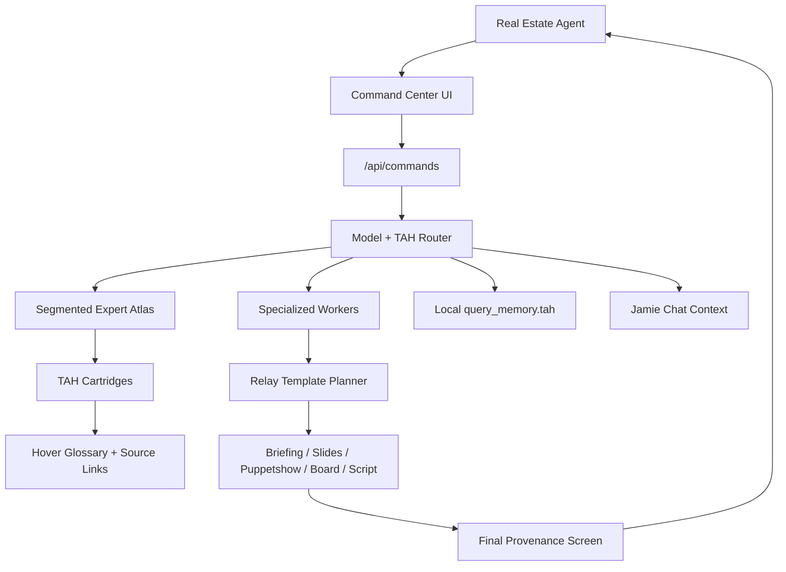

# Sunset Pulse

Sunset Pulse is a real estate agent command center powered by local TAH intelligence.

It is built around a simple thesis: agents should not have to send every workflow to one giant model. Sunset Pulse turns real estate knowledge into compact `.tah` command files, routes narrow commands to specialized workers, and remembers useful context locally so future queries cost fewer tokens.

## What It Does

- Lets agents command specialized AI workers instead of chatting with one generic model.
- Uses `.tah` cartridges as the primary structured context layer.
- Packs large knowledge libraries into a segmented 400-expert atlas for fast retrieval.
- Routes commands through real estate workers such as Lead Scoring, Follow-Up Writer, Neighborhood Explainer, Comp Analysis, Local Commerce, Agent Voice, and Supervisor Check.
- Supports delivery modes: briefing, slideshow, puppetshow, field-board, and script.
- Adds a final provenance screen to every relay explaining where the information came from and what the user learned.
- Saves local query memory to `query_memory.tah` so repeated work can reuse local context.
- Links dense terms and acronyms to hover definitions sourced from local `.tah` cartridges.
- Shares Command Center context with Jamie so chat answers can use the same private helper layer.

## Current Release

Current local release: **v0.2.0 - TAH Command Center**

Release notes:

- [CHANGELOG.md](CHANGELOG.md)
- [apps/pulse/docs/releases/v0.2.0-tah-command-center.md](apps/pulse/docs/releases/v0.2.0-tah-command-center.md)

Recent local additions:

- Command Center helper selection now uses a professional arena-style UI with imported ClaudeCraft assets.
- Sunset Chat can hand a note-writing request into Command Center without pre-filling messy input text.
- Jamie chat routes now share the Command Center helper context through `/api/jamie/chat`.
- TAH glossary terms such as `CCS`, `PENDING`, `Service Request`, `TREC`, `MLS`, `IDX`, and `pgvector` show hover definitions.
- Glossary terms can semantically link back to source cartridges, such as `dallas_community_intel.tah` through `/tah/dallas-community-intel`.

## Monorepo Layout

```text
SunsetPulse/
  apps/
    pulse/                  Next.js app for Sunset Pulse
      app/command-center/   Agent command center route
      app/api/commands/     Command router API
      app/api/jamie/chat/   Jamie chat alias wired to the shared helper route
      app/api/tah/          TAH catalog, fact, forge, and search APIs
      cartridges/           Local TAH inputs and generated archives
      components/           UI components
      components/glossary/  Shared hover/link glossary renderer
      docs/                 Pulse-specific docs
      lib/command-center/   Workers, router, synonyms, relay templates, query memory
      lib/core/             TAH, Memoria, atlas, and orchestration primitives
      lib/glossary/         Site glossary terms mapped to TAH source cartridges
  packages/                 Shared workspace packages
  assets/                   Static and generated assets
```

## Architecture



## TAH Intelligence Layer

TAH files are compact knowledge capsules. The command center currently includes first-party capsules such as:

- `agent_brand.tah`
- `lead_history.tah`
- `listing_context.tah`
- `neighborhood_context.tah`
- `comps_context.tah`
- `objection_scripts.tah`
- `local_business_context.tah`
- `market_rules.tah`

The app can also pack many local and upstream cartridges into:

```text
apps/pulse/cartridges/expert-atlas/segmented_expert_atlas.hat
apps/pulse/cartridges/expert-atlas/segmented_expert_atlas.tah
```

The expert atlas uses segmented metadata so retrieval can start near the middle of the index and quickly reject irrelevant shards by domain, complexity, density, vitality, and concept links.

## Command Center

Route:

```text
/command-center
```

API:

```text
GET  /api/commands     # relay template and format catalog
POST /api/commands     # route a command through worker + TAH retrieval
```

Jamie route alias:

```text
POST /api/jamie/chat   # same Jamie response path with Command Center helper context
```

Example request:

```bash
curl -X POST http://127.0.0.1:3002/api/commands \
  -H "Content-Type: application/json" \
  -d "{\"command\":\"Explain the community and nearby shops\",\"relayMode\":\"slideshow\",\"supervisor\":true}"
```

Supported `relayMode` values:

- `briefing`
- `slideshow`
- `puppetshow`
- `field-board`
- `script`

## Relay Templates

Relay templates tell the robot how to explain what it learned from TAH files.

The catalog currently contains **68 content templates** and **5 delivery formats**.

Docs:

- [apps/pulse/docs/TAH_RELAY_TEMPLATE_CATALOG.md](apps/pulse/docs/TAH_RELAY_TEMPLATE_CATALOG.md)

Every relay plan includes:

- selected content template,
- delivery format,
- visual motif and layout,
- wording guidance,
- section instructions,
- source anchors,
- final provenance screen.

## Semantic Glossary

Sunset Pulse renders common acronyms and domain terms as hoverable glossary terms on knowledge-heavy surfaces.

Current glossary behavior:

- shows a short definition on hover or keyboard focus,
- keeps the visible text unchanged,
- stores the source `.tah` file on the term,
- links known terms to their cartridge page when available.

Examples:

- `CCS` links to `dallas_community_intel.tah` through `/tah/dallas-community-intel`.
- `PENDING` explains that the request is received but not closed.
- `Service Request` explains the city tracking record behind a 311 item.
- `TREC`, `MLS`, `IDX`, `TAH`, and `pgvector` link to their relevant knowledge cartridges.

Glossary implementation:

```text
apps/pulse/lib/glossary/siteGlossary.ts
apps/pulse/components/glossary/GlossaryText.tsx
```

Glossary-aware surfaces currently include:

- Command Center answers and source excerpts,
- TAH cartridge pages,
- TAH library and master-search results,
- Jamie chat messages.

## Local Query Memory

Sunset Pulse saves compact local memory records after command-center queries:

```text
apps/pulse/cartridges/query_memory.tah
```

This file is intentionally ignored by Git. It stays local to the user machine.

What gets saved:

- command,
- intent,
- worker,
- relay template and mode,
- source TAH files used,
- top concepts,
- learned recap,
- summary and actions.

Docs:

- [apps/pulse/docs/TAH_QUERY_MEMORY.md](apps/pulse/docs/TAH_QUERY_MEMORY.md)

Disable query memory:

```bash
PULSE_QUERY_MEMORY_DISABLED=true
```

Use a custom memory path:

```bash
PULSE_QUERY_MEMORY_PATH=C:\path\to\query_memory.tah
```

## Getting Started

Install dependencies:

```bash
npm install
```

Run the Pulse app:

```bash
npm run pulse:dev
```

Or from the app workspace:

```bash
cd apps/pulse
npm run dev
```

Open:

```text
http://127.0.0.1:3000/command-center
```

If another dev server is already running, Next.js may choose another port such as `3002`.

## Useful Scripts

From the repo root:

```bash
npm run pulse:dev
npm run pulse:build
npm run test:unit
npm run test:e2e
```

From `apps/pulse`:

```bash
npm run tah:pack-expert-atlas
npm run tah:pack-master
npm run test:unit
npm run build
```

## Verification

Common local checks:

```bash
npx tsc -p apps/pulse/tsconfig.json --noEmit --pretty false
npm run tah:pack-expert-atlas --workspace=apps/pulse
```

Smoke-test the command route:

```bash
curl -X POST http://127.0.0.1:3002/api/commands \
  -H "Content-Type: application/json" \
  -d "{\"command\":\"Give me a valuation using recent sales\",\"relayMode\":\"slideshow\",\"supervisor\":true}"
```

## Important Docs

- [apps/pulse/docs/TAH_RELAY_TEMPLATE_CATALOG.md](apps/pulse/docs/TAH_RELAY_TEMPLATE_CATALOG.md)
- [apps/pulse/docs/TAH_QUERY_MEMORY.md](apps/pulse/docs/TAH_QUERY_MEMORY.md)
- [apps/pulse/docs/CMS_USB_BRIDGE.md](apps/pulse/docs/CMS_USB_BRIDGE.md)
- [apps/pulse/docs/LOCAL_NEWS_SIGNALS.md](apps/pulse/docs/LOCAL_NEWS_SIGNALS.md)

## Notes On Generated Files

The repo ignores broad `.tah` and `.hat` generated files by default. The first-party command-center capsules are explicitly unignored in `.gitignore` so they can travel with the app.

Generated or local-only artifacts should remain untracked:

- `apps/pulse/cartridges/query_memory.tah`
- `apps/pulse/cartridges/expert-atlas/segmented_expert_atlas.hat`
- `apps/pulse/cartridges/expert-atlas/segmented_expert_atlas.tah`

## Status

This is a local-first, practical implementation. The system is designed to work with cheap/small models and private `.tah` context before adding heavier agent frameworks or vector infrastructure.
