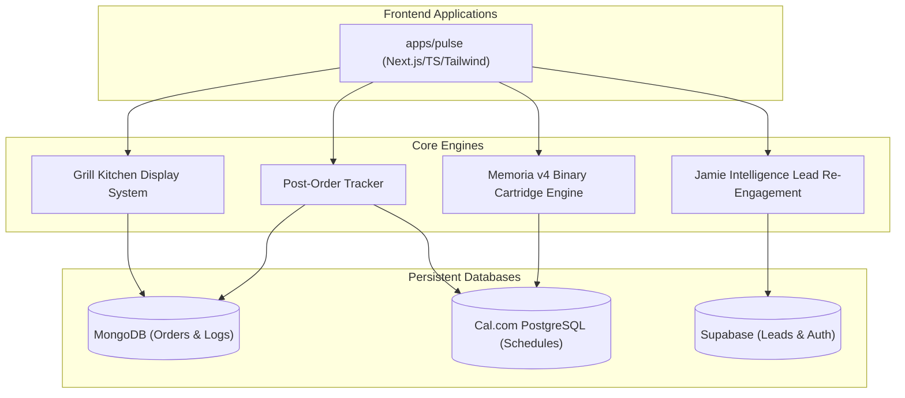

# 🌅 Sunset Pulse Monorepo

Welcome to **Sunset Pulse**—a premium, high-availability real estate IDX intelligence platform and digital-to-physical portal system. This monorepo consolidates our modern Next.js/TS web interfaces, backend orchestration networks, and localized physical operations (including the high-performance **Sunset Grill**).

---

## 🏗️ Monorepo Architecture

This workspace is managed as a high-speed, consolidated monorepo:



### Key Folders
* **`apps/pulse`**: The core Next.js application containing the real estate search portal, interactive 3D spatial mapping, and physical Sunset Grill ordering, checkout, and tracking screens.
* **`packages/`**: Reusable code, core typings, and geographical binary utilities.
* **`cartridges/`**: Compiled binary geographical indices (`.hat` / `.tah`) using our proprietary Memoria v4 high-speed layout.

---

## ⚡ Core Feature Highlights

### 1. 3D Spatial IDX Search (Sunset Pulse Real Estate)
* **Narrative Spatial Flow**: Edge-to-edge interactive Three.js renders mapping live real-estate properties to physical coordinates.
* **High-Speed Geographic Lookups**: Powered by the **Memoria v4 Binary format**, allowing geographical place records (the `PLACE_TABLE` section) to be resolved instantly in $O(1)$ from fixed-width 128-byte binary entries, eliminating raw database scans.

### 2. High-Performance Sunset Grill & KDS
* **Digital-to-Physical Kitchen Grid**: Customers can place orders via **Pay at Counter** or **Stripe Checkout** which get instantly written to MongoDB and streamed to the Kitchen Display System (KDS).
* **Domino's-Style Post-Order Tracker**: Located at `/grill/tracker/[orderId]`, a dark-themed, glassmorphic real-time screen showing order progress (Received ➜ Sizzling ➜ Pickup). Includes custom CSS flickering flame animations, floating stars, audio alerts, and real-time polling.
* **Cal.com Shift Roster Binding**: Automatically cross-references Cal.com PostgreSQL scheduling tables via Prisma at order creation time. Shows the active scheduled cook actively preparing the meal (e.g., *"Grill Master Shaikh is sizzling your burger"*).

### 3. Advanced Shift & SMS Dispatch Scheduler
* **Split-Shift Orchestration**: Splitting shifts into morning, mid-afternoon, and closing slots with automatic overlapping shift validations.
* **Draft Sandboxing**: Allows admins to construct upcoming weekly draft rosters in sandboxed buffers without altering active live shifts.
* **SMS Drop & Backfill Engine**: Automatically handles late-shift drops via a multi-tiered Twilio auto-escalation broadcast. Integrates a secure webhook at `/api/scheduling/sms/incoming` allowing employees to claim available shifts atomically by replying `"ACCEPT"`.

### 4. Jamie Intelligence Agent
* **Lead Re-engagement Hook**: Monitors Lead scores in Supabase (with automated conflict handling on unique emails). Formulates hyper-personalized SMS and email re-engagement copy on time-decayed prospects using our custom intelligence module.

---

## 🛠️ Tech Stack & Database Interoperability

Our architecture bridges multiple data layers to maximize scalability and write-throughput:

| Database | Primary Role | Driver / ORM | Focus |
| :--- | :--- | :--- | :--- |
| **Supabase (PostgreSQL)** | Leads, authentication, global preferences | `@supabase/supabase-js` | Performance and auth integrity |
| **Cal.com (PostgreSQL)** | Roster schedules, booking, and shift dispatches | Prisma Client | Roster scheduling and SMS webhooks |
| **MongoDB** | Active grill orders, checkout sessions, and telemetry | Mongoose | High-throughput, schemaless order logs |
| **Memoria v4 (`.hat`/`.tah`)**| Geographic places database and metadata indexes | Custom Binary Stream Buffer | High-speed, cold-start spatial lookups |

---

## 🚀 Getting Started

### Local Development

1. **Environment Configuration**:
   Review `.env.local` inside `apps/pulse` to ensure your database connection strings (MongoDB, Cal.com PostgreSQL, Supabase) and Twilio/Stripe API keys are populated.

2. **Boot the Dev Server**:
   Start the Next.js development server locally:
   ```bash
   # Run the Pulse dev workspace
   npm run pulse:dev
   ```

3. **Compile the Spatial Catalog**:
   Pack current geographic text shards and place coordinate indices into the high-speed Memoria v4 binary cartridge:
   ```bash
   npm run tah:pack-master
   ```

### Running Tests

Execute the complete test suites (including our read-after-write binary parity checks for Memoria v4):
```bash
npm run test:unit
```

---
