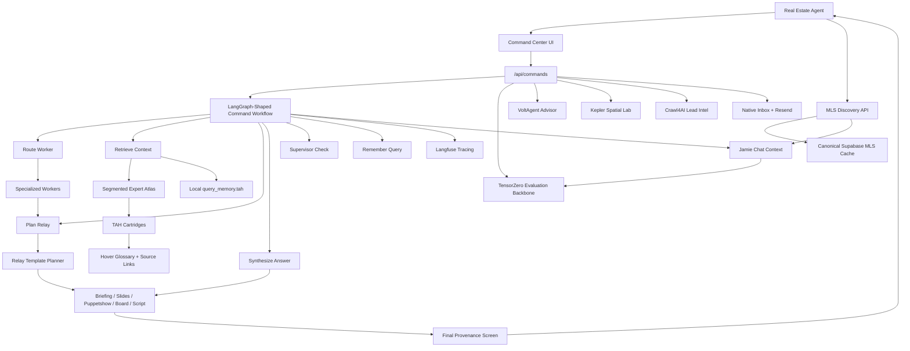
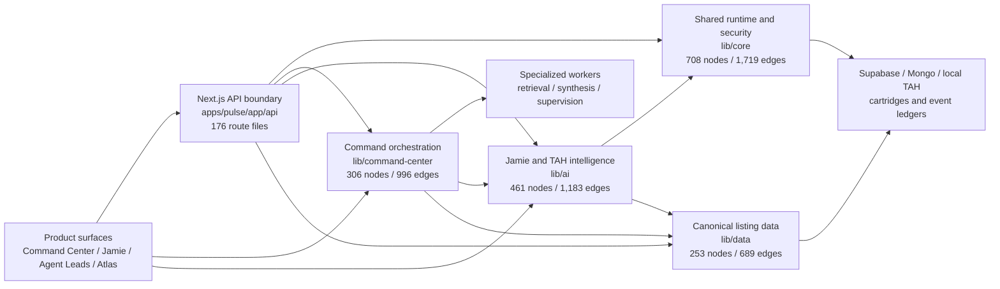

# Sunset Pulse

Sunset Pulse is a real estate command center built around local TAH intelligence.

Instead of sending every task to a massive remote model, Sunset Pulse packages domain knowledge into compact `.tah` cartridges. It routes commands to targeted AI workers and keeps query memory on your local machine so future lookups remain fast and token-efficient.

## What It Does

- Gives agents specialized AI workers to run targeted tasks instead of chatting with a single generic bot.
- Uses binary `.tah` cartridges as the primary structured context layer.
- Packs large domain libraries into a 400-expert atlas for quick sub-millisecond retrieval.
- Routes commands through dedicated workers including Lead Scoring, Follow-Up Writer, Neighborhood Explainer, Comp Analysis, Local Commerce, Agent Voice, and Supervisor Check.
- Runs the Command Center engine through an observable LangGraph-style workflow with distinct stages for routing, context retrieval, planning, synthesis, supervision, local memory, and response formatting.
- Offers five distinct output modes: briefing, slideshow, puppetshow, field-board, and script.
- Includes a provenance summary on every result showing exactly where the data originated.
- Saves query memory to a local `query_memory.tah` cartridge so repeated queries reuse context automatically.
- Integrates hover definitions for acronyms and terms directly from local `.tah` cartridges.
- Shares Command Center context with Jamie so chat responses use the same background helper notes.
- Delivers image-verified MLS inventory through a shared discovery engine for Jamie and the public API.
- Features a local Play Jamie game room with complete legal chess, falling blocks, heads-up Texas Hold'em, and beach volleyball.

## Current Release

Profit-focused weekly execution is tracked in [`docs/profit-sprint-2026-08-24.md`](./docs/profit-sprint-2026-08-24.md). Luna's canonical outcome-billing implementation plan is [`docs/luna-outcome-revenue-plan-2026-08-24.md`](./docs/luna-outcome-revenue-plan-2026-08-24.md), with the operator handoff in [`docs/luna-shadow-operations-runbook.md`](./docs/luna-shadow-operations-runbook.md) and the daily record in [`docs/luna-shadow-evidence-log.md`](./docs/luna-shadow-evidence-log.md); implementation notes, tests, and commits should reference its `LUNA-*` ticket IDs.

Supabase egress reduction is tracked in [`docs/supabase-egress-reduction-plan-2026-08-26.md`](./docs/supabase-egress-reduction-plan-2026-08-26.md). Public listing feeds are bounded and revalidated while high-volume sources are measured.

The Vibe Dictionary modernization plan is [`docs/vibe-dictionary-wordpress-plan-2026-08-25.md`](./docs/vibe-dictionary-wordpress-plan-2026-08-25.md). It defines the WordPress-style admin workflow, revisions, publishing gates, taxonomy, media, and safe Launch Kit integration.

Outcome prices are research hypotheses, not active customer charges. Legal approval is reported complete under `LUNA-003`; Stripe outcome metering remains gated on the 14-day shadow evidence, pricing decision, reconciliation, and controlled-cohort checks.

### Luna Outcome Revenue Status

The outcome-revenue system is approximately **82% implemented**. Completed foundations include deterministic outcome contracts, immutable outcome and internal-cost ledgers, authoritative booking lineage, Jamie booking actions, commercial agent queues, shadow invoices, dispute credits, evidence-gated pricing decisions, controlled launch gates, tenant conversion baselines, and operator baseline/checkpoint controls.

Legal approval is reported complete and must be retained with the tenant launch record. The remaining work is operational: seed approved baseline values, collect 14 complete shadow checkpoints, verify production cost and conversion evidence, reconcile results, and approve a controlled cohort. Stripe outcome submission remains disabled until those gates pass. Follow the [`Luna shadow operations runbook`](./docs/luna-shadow-operations-runbook.md) for the handoff procedure.

Current local release: **v0.3.0 - Research Desk**

## August 24, 2026 Profit Controls

Active branch:
```text
codex/jamie-model-routing
```

The current profit sprint turns Jamie activity into an attributable operating funnel instead of relying on inbox reads or inferred outcomes. The operator scorecard is available at:

```text
/admin/profit
GET /api/admin/profit/scorecard
```

Implemented controls:
- Durable funnel IDs join Jamie sessions, consented handoffs, leads, notifications, contact attempts, customer responses, appointments, values, revenue, and variable costs.
- Contact attempts and customer responses are authoritative receipts. Opening an alert or contact control is not counted as completed outreach.
- Zero-result rental searches retain qualification context and offer an explicit, consented agent search without claiming a saved search or agent contact occurred prematurely.
- Commercial listing answers are rebuilt from validated inventory, carry MLS provenance, and are protected by the blocking `test:inventory-truth` CI gate.
- Hot-alert delivery and agent contact latency are measured separately. Delivered hot leads without contact receipts escalate only after configurable operating minutes.
- Daily privacy-safe profit checkpoints establish baseline continuity, identify exact missed dates, and send idempotent operator alerts when collection gaps appear.
- Margin experiments remain blocked until the readiness gate passes all required volume, attribution, cost, and checkpoint criteria.

Margin experiment readiness requires:
- Seven distinct daily checkpoints in the rolling window.
- At least 10 qualified leads and 3 closed leads.
- At least 95% funnel identity coverage.
- At least 95% closed-revenue, model-cost, and notification-cost coverage.

The current scorecard returns `continue_baseline` until every criterion passes. It returns `start_margin_experiments` only when the complete gate is satisfied.

Relevant scheduled workers:
```text
GET /api/notifications/high-intent/cron       # every five minutes
GET /api/admin/profit/baseline/cron           # daily at 12:15 UTC
```

Operating-hours configuration:
```text
AGENT_ALERT_OPERATING_TIME_ZONE=America/Chicago
AGENT_ALERT_OPERATING_WEEKDAYS=1,2,3,4,5
AGENT_ALERT_OPERATING_START_HOUR=8
AGENT_ALERT_OPERATING_END_HOUR=18
AGENT_ALERT_CONTACT_THRESHOLD_MINUTES=10
```

Database migrations under `apps/pulse/supabase/migrations/20260824*.sql` add opportunity values, cost and engagement receipts, durable funnel identity, unattended-lead escalation, and profit baseline checkpoints. Apply migrations before deploying the scorecard or scheduled workers.

Recent additions:
Research Desk WIP eliminates data entry bottlenecks so agents spend less time filling out web forms and more time working with clients. Instead of forcing someone to manually enter 15 fields for every prospective lead, the engine accepts unstructured text, parses it asynchronously, verifies the facts, and routes the lead to the correct pipeline stage.

Single Table Design:
The underlying schema relies on clear Enum state transitions (such as research, new, and contacted). This allows incoming leads to move seamlessly from an unverified Investigation Desk into an active sales pipeline via basic state updates while keeping attachments, property records, and notes intact.

## August 15, 2026 Work Wrap-Up

Active branch:
```text
codex/crawler-operations-and-retrieval
```

Completed today:
- Replaced the Novu-centered alert path with native agent notifications, durable delivery rows, Resend email delivery, and optional Telnyx SMS opt-in.
- Hardened Wikipedia crawler operations with persisted heartbeats, retry-state telemetry, production-safe resume commands, circuit-breaker behavior, and a health cron for stale or degraded crawler states.
- Added the Atlas Retrieval Inspector so operators can inspect the same bounded retrieval path Jamie uses, including cartridge candidate counts, matched sources, fallback state, crawler state, and elapsed time.
- Added a 20-fixture retrieval evaluation corpus and local runner for repeatable Jamie retrieval baselines.
- Added demand-aware crawler acquisition and term-level indexed TAH probes so retrieval misses can feed crawler priority instead of waiting behind exhaustive enumeration.
- Documented the native notification, crawler, and retrieval operating model in the root README and Pulse app README.

Measured retrieval baseline:
```text
Initial strict baseline:       0/20 fixtures, 510 ms average
Candidate Ranking v2:          4/20 fixtures,  76 ms average
Demand-aware acquisition pass:  9/20 fixtures, 203 ms average
Canonical demand resolution:   14/20 fixtures, 192 ms average
```

Next actionables:
- Continue crawler acquisition for the remaining failed retrieval fixtures and rerun `npm run atlas:evaluate-retrieval`.
- Monitor `/atlas` crawler health for retry recovery, stale heartbeat, zero-success batches, and estimated completion drift.
- Validate production env coverage for `CRON_SECRET`, `RESEND_API_KEY`, `OPERATOR_EMAIL`, `NEXT_PUBLIC_SUPABASE_URL`, and `SUPABASE_SERVICE_ROLE_KEY`.
- Keep `.pulse-local/wikipedia/` and `.pulse-local/wikipedia/demand-queue.json` ignored; they are runtime checkpoints, not source artifacts.
- Resolve the existing strict TypeScript backlog before treating full-app `tsc --noEmit` as a blocking PR gate.

## SaaS Agent Sites (WIP)

Sunset Pulse is expanding from an individual agent command center into a multi-tenant platform for real estate agents. New agents will be able to launch branded consumer sites with an AI assistant, fresh MLS listings, and lead capture without editing code.

### Vibe CMS review status

The first Vibe CMS vertical is implemented on PR #67: structured drafts, immutable review revisions, publication, Launch Kit application, public visual/voice projection, lifecycle audits, and rollback. The PR-scope reconciliation is complete; the 58-file diff is limited to the Vibe workspace, Vibe APIs and model, scoped access helpers and tests, CMS documentation, and this README. Automated CI and preview deployment gates are green. The only remaining release evidence is the controlled-site operator cycle described below.

The operator workspace is intentionally WordPress-familiar while preserving the safer Vibe-to-site handoff: `/vibes` provides status views, search, sorting, pagination, row actions, and guarded transactional bulk archive/trash. Bulk actions validate every selected Vibe and stop with a conflict if one changes concurrently. The editor has a Publish rail, lifecycle audit history, immutable revision history, and editable visual-system controls for colors, typography, and layout; taxonomy has controlled-term discovery and usage counts. Its authenticated draft preview renders that complete visual system and the selected Jamie voice tone without applying anything to a site. New Vibes can start from visual, independent Default, Editorial warmth, or Market intelligence preset cards backed by one shared, contract-tested catalog. The picker makes each preset's colors, typography, and layout visible before creation. A selected preset seeds those values plus controlled taxonomy terms and Jamie's primary voice tone into that new draft; it is an editable starting point, not a live link. Templates, media, comments, scheduling, and access-model redesign remain deliberately out of this PR. Publishing a Vibe still does **not** change a live site—application remains a separate protected action.

#### Required deployed verification before merge

Use one disposable Vibe and one controlled Launch Kit site. Record the deployed URL, UTC time, Vibe ID, site ID, each submitted/published revision ID, the before/after site pointer, the public `data-vibe-revision-id`, visible CSS token values, and assistant voice tone.

1. Create the Vibe, save structured visual and linguistic fields, and open its authenticated draft preview.
2. Submit and publish the resulting immutable revision, then use the protected application screen to apply that exact revision to the controlled site.
3. Confirm the public site exposes the applied revision ID, the expected compiled tokens, and the published assistant tone.
4. Edit the draft but do not publish or apply it; confirm the public revision and presentation stay unchanged.
5. Complete a second submit/publish/apply cycle, then restore an earlier snapshot through the auditable rollback path.
6. Restore the controlled site to its original revision and preserve the evidence record with the PR head SHA.

Green automated checks do not replace this flow. Keep the WIP exception scoped to Vibe routes and set `VIBE_CMS_PUBLIC_WRITE_WIP=false` before production release.

The dedicated protected test hostname is [vibes-test.sunsetpulse.app](https://vibes-test.sunsetpulse.app). It is aliased to the current `codex/vibe-cms-baseline` Vercel preview deployment, not the production `main` deployment, and is the canonical Vibe CMS target from this point forward. Vercel aliases are deployment-specific, so refresh this alias after each successful PR deployment before manual testing. It requires a Vercel-authenticated browser session; do not disable deployment protection. Use `vercel curl` for protected automated checks. The deployed list, creation, editor, preview, revisions, audit, protected apply screen, taxonomy, and their GET APIs were smoke-checked with HTTP 200 on 2026-08-30.

#### PR #67 pre-merge readiness

Included in the PR:

- WordPress-familiar Vibe list management, search, status filters, sorting, pagination, row actions, and transactional bulk actions.
- Draft creation with shared presets, editable visual and linguistic fields, controlled taxonomy, and authenticated visual/voice preview.
- Submit, reject, publish, immutable revision history, revision comparison, restore, archive, trash, audit history, site application, and rollback surfaces.
- Vibe-scoped WIP access that avoids the legacy `/admin` boundary during testing; `VIBE_CMS_PUBLIC_WRITE_WIP=false` restores operator-only access.
- Contract and access tests, the implementation baseline, the production verification record, and the protected test-host workflow.

Completed gates:

- [x] PR diff reconciled against `origin/main`; unrelated platform files are excluded.
- [x] `git diff --check` passes and the working tree is clean.
- [x] Focused Vibe CMS access and contract suite passes (16 tests).
- [x] GitHub lint, unit, Jamie E2E, and Vercel deployment checks pass.
- [x] PR is reported mergeable with a clean merge state.
- [x] Protected test hostname is assigned to the current successful PR deployment and `/vibes` is reachable through authenticated Vercel tooling.

Manual release evidence still required unless explicitly waived by the product owner:

- [ ] Run the create/save/preview/submit/publish/apply flow against one controlled Launch Kit site.
- [ ] Confirm draft/live isolation, public revision metadata, visual tokens, and Jamie voice tone.
- [ ] Run a second editorial cycle, then rollback and restore the site's original pointer.
- [ ] Complete [the production verification record](apps/pulse/docs/VIBE_CMS_PRODUCTION_VERIFICATION.md) with IDs, timestamps, before/after pointers, screenshots or observations, and the tested PR head SHA.
- [ ] Set `VIBE_CMS_PUBLIC_WRITE_WIP=false` before treating the feature as production-released.

- [Luna implementation baseline](apps/pulse/docs/VIBE_CMS_LUNA_BASELINE.md)
- [Sol review and remediation report](apps/pulse/docs/VIBE_CMS_SOL_REVIEW_REPORT.md)
- [Production verification record](apps/pulse/docs/VIBE_CMS_PRODUCTION_VERIFICATION.md)

Target URL structure:
```text
{agent}.sunsetpulse.app
{agent}.sunsetpulse.app/properties/{mlsId}
```

Current progress:
- **Swappable agent profiles**: Loads agent names, brokerage info, licenses, market areas, photos, assistant names, and compliance text from profile records.
- **Subdomain tenant routing**: Directs traffic based on subdomains like `taz.sunsetpulse.app`.
- **Clean public shell**: Hides internal command center tools and developer utilities on public consumer pages.
- **MLS hot-list publishing**: Lets agents feature specific MLS IDs on their homepage.
- **Image validation rule**: Filters out listings with missing or broken image links so cards never render blank.
- **Branded detail pages**: Renders listing photos, price, specs, agent callouts, and disclaimers at `/properties/:id`.
- **Lead routing**: Directs inquiries to the agent's preferred contact email and phone.
- **Compliance controls**: Manages footers, MLS disclaimers, and equal-housing copy per agent profile.
- **Custom assistant branding**: Allows renaming or re-skinning Jamie for individual agent brands.
- **Supabase configuration**: Stores agent, assistant, compliance, and integration settings in structured JSON fields.
- **Seed scripts**: Includes automated scripts to insert or update agent profiles without hand-editing SQL tables.

Backlog:
- Admin UI for editing agent profiles without running database scripts.
- Custom domain mapping for agent subdomains.
- Per-agent MLS source controls and default filter settings.
- Branded lead capture forms to complement standard email and phone links.
- Automated social preview images and meta tags for listings.
- Completeness checker to prevent publishing incomplete agent profiles.

## Monorepo Layout

```text
SunsetPulse/
  apps/
    pulse/                  Next.js app for Sunset Pulse
      app/command-center/   Agent command center route
      app/jamie-chat/       Maximized assistant-ui Jamie workspace
      app/play-jamie/       Jamie game room, chess, Block Drop, poker, and volley routes
      app/api/commands/     Command router API
      app/api/agents/       AI agent framework endpoints
      app/api/sqlsync/      SQLSync-ready mutation snapshots
      app/api/tensorzero/   TensorZero evaluation and JamieChat snapshots
      app/api/kepler/       Kepler.gl dataset feeds
      app/api/properties/discover/
                            Image-qualified MLS discovery API
      app/api/intelligence/ Lead intelligence ingestion APIs
      app/api/notifications/ Native inbox and external-delivery workers
      app/api/jamie/chat/   Jamie chat alias wired to the shared helper route
      app/api/tah/          TAH catalog, fact, forge, and search APIs
      cartridges/           Local TAH inputs and generated archives
      components/           UI components
      components/glossary/  Shared hover/link glossary renderer
      docs/                 Pulse-specific docs
      lib/command-center/   Workers, router, synonyms, relay templates, query memory
      lib/agents/           VoltAgent and agent-framework adapters
      lib/core/             TAH, Memoria, atlas, and orchestration primitives
      lib/glossary/         Site glossary terms mapped to TAH source cartridges
      lib/observability/    Langfuse tracing helpers
      lib/sqlsync/          SQLSync-ready mutation journal helpers
      lib/tensorzero/       TensorZero-ready evaluation ledgers
      lib/lead-intel/       Crawl4AI lead intelligence ledger helpers
      lib/notifications/    Resend and optional Telnyx delivery adapters
      lib/data/             Canonical listing contract, repository, MLS sync, and discovery engine
      lib/jamie-games/      Local game rules, opponents, and commentary
      scripts/              TAH import, packing, and local index utilities
      tensorzero/            TensorZero gateway config stubs
      workers/lead-intel-crawler/
                               Optional Python Crawl4AI worker
  packages/                 Shared workspace packages
  assets/                   Static and generated assets
```

## Architecture


```mermaid
flowchart TD
  Agent["Real Estate Agent"] --> UI["Command Center UI"]
  UI --> API["/api/commands"]
  API --> Graph["LangGraph-Shaped Command Workflow"]
  Graph --> Route["Route Worker"]
  Graph --> Retrieve["Retrieve Context"]
  Graph --> Plan["Plan Relay"]
  Graph --> Synthesize["Synthesize Answer"]
  Graph --> Supervise["Supervisor Check"]
  Graph --> Remember["Remember Query"]
  Graph --> Observe["Langfuse Tracing"]
  API --> TZero["TensorZero Evaluation Backbone"]
  API --> Volt["VoltAgent Advisor"]
  API --> Kepler["Kepler Spatial Lab"]
  Route --> Workers["Specialized Workers"]
  Retrieve --> Atlas["Segmented Expert Atlas"]
  Retrieve --> Memory["Local query_memory.tah"]
  Graph --> Jamie["Jamie Chat Context"]
  Jamie --> TZero
  API --> Crawl4AI["Crawl4AI Lead Intel"]
  API --> Notify["Native Inbox + Resend"]
  Agent --> Discovery["MLS Discovery API"]
  Discovery --> Listings["Canonical Supabase MLS Cache"]
  Discovery --> Jamie
  Atlas --> TAH["TAH Cartridges"]
  TAH --> Glossary["Hover Glossary + Source Links"]
  Workers --> Plan
  Plan --> Relay["Relay Template Planner"]
  Synthesize --> Output["Briefing / Slides / Puppetshow / Board / Script"]
  Relay --> Output
  Output --> Final["Final Provenance Screen"]
  Final --> Agent
```

## Graph-Derived Code Map

The map below was verified against a local Codebase Memory index on August 13, 2026. The fast index found 47,186 nodes and 192,852 relationships across TypeScript, JavaScript, Python, CSS, SQL, YAML, C#, and supporting files. It recognized 435 route nodes and 481 HTTP call relationships.

The repository also contains substantial scheduling and shared platform code under `apps/scheduling`, `apps/api/v2`, and `packages`. Those systems dominate repository-wide hotspot rankings, so Sunset Pulse product analysis should normally begin with the scoped `apps/pulse` domains below.


```mermaid
flowchart LR
  Surfaces["Product surfaces<br/>Command Center / Jamie / Agent Leads / Atlas"]
  Routes["Next.js API boundary<br/>apps/pulse/app/api<br/>176 route files"]
  Command["Command orchestration<br/>lib/command-center<br/>306 nodes / 996 edges"]
  Intelligence["Jamie and TAH intelligence<br/>lib/ai<br/>461 nodes / 1,183 edges"]
  Core["Shared runtime and security<br/>lib/core<br/>708 nodes / 1,719 edges"]
  Listings["Canonical listing data<br/>lib/data<br/>253 nodes / 689 edges"]
  Storage["Supabase / Mongo / local TAH<br/>cartridges and event ledgers"]
  Workers["Specialized workers<br/>retrieval / synthesis / supervision"]

  Surfaces --> Routes
  Surfaces --> Command
  Surfaces --> Intelligence
  Routes --> Core
  Routes --> Command
  Routes --> Intelligence
  Routes --> Listings
  Command --> Workers
  Command --> Intelligence
  Command --> Listings
  Intelligence --> Core
  Intelligence --> Listings
  Core --> Storage
  Listings --> Storage
```

High-value graph entry points:

| Domain | Entry points and hotspots |
| --- | --- |
| Command Center | `runCommandCenterCommand`, `retrieveContextNode`, `applyTahRetrievalPolicy`, `buildCommandDeliverable` |
| Jamie | `getJamieResponse`, `runPublicJamieGuide`, `sanitizeJamieReply`, `resolveJamieListingContext` |
| TAH and Atlas | `listPulseCartridges`, `pulse_search`, `getCartridgeMetadata`, `getTahIndices` |
| Listings | `normalizeListing`, `searchListings`, `getListingById`, `discoverListings` |
| Security and APIs | `requireOperatorRouteAccess`, `getSessionUser`, `errorResponse`, `successResponse` |
| Agent operations | `AgentConsole`, `AgentSelectionArena`, `AgentLeadActions`, `trackAgentConsoleEvent` |

### Local Code Graph

Codebase Memory is an optional local engineering tool. Its executable and generated graph are intentionally excluded from Git:

```text
.local-tools/codebase-memory-mcp/
.codebase-memory/
```

With the verified executable installed at the ignored local path, refresh the fast index:

```powershell
.\.local-tools\codebase-memory-mcp\app\codebase-memory-mcp.exe cli --progress index_repository --repo-path "C:\Users\Taz\SunsetPulse" --mode fast --name SunsetPulse --persistence false
```

Query a product domain:

```powershell
.\.local-tools\codebase-memory-mcp\app\codebase-memory-mcp.exe cli get_architecture --project SunsetPulse --path apps/pulse/lib/command-center --aspects overview
```

Start the persistent local graph application and open `http://127.0.0.1:9749`:

```powershell
.\.local-tools\codebase-memory-mcp\app\codebase-memory-mcp.exe daemon start
```

Fast mode intentionally excludes tests and other filtered files. Treat graph absence as provisional until `check_index_coverage` and direct source inspection confirm the relevant paths.

## MLS Discovery Engine

Sunset Pulse serves property search queries from a local canonical MLS cache. This avoids making slow external API calls during page loads. Both Jamie and the public discovery API rely on this shared engine:

```text
GET /api/properties/discover
```

A property listing is eligible for discovery only when it meets four strict criteria:
- Sourced from active MLS sync data.
- Explicitly marked active, non-demo, and approved for public display.
- Updated within the designated freshness window (30 days by default).
- Accompanied by at least one valid HTTPS photo URL.

Query parameters:

| Parameter | Purpose |
| --- | --- |
| `location`, `city`, `zipcode` | Address or market text match |
| `propertyType`, `propertyTypes` | One or more types; repeat or comma-separate values |
| `priceMin`, `priceMax` | Inclusive price range (`minPrice` and `maxPrice` are aliases) |
| `bedsMin`, `bedsMax`, `bathsMin`, `sqftMin` | Minimum or maximum property attributes |
| `bounds=west,south,east,north` | Map viewport filter, including antimeridian-aware bounds |
| `center=longitude,latitude` + `radiusMiles` | Radius filter and distance calculation |
| `sort` | `newest`, `price_asc`, `price_desc`, or `distance` |
| `page`, `pageSize` | Page controls (capped at 100 per page) |
| `maxAgeHours` | Override default freshness window up to 8760 hours (one year) |

Example query:

```bash
curl "http://127.0.0.1:3000/api/properties/discover?city=Frisco&propertyType=Single%20Family&priceMin=500000&priceMax=900000&bedsMin=4&pageSize=12"
```

Key code files:
```text
apps/pulse/lib/data/listingDiscovery.ts
apps/pulse/lib/data/listingRepository.ts
apps/pulse/lib/data/listingContract.ts
apps/pulse/app/api/properties/discover/route.ts
apps/pulse/lib/ai/jamieTools.ts
```

Run database migrations before launching:
```text
apps/pulse/supabase/migrations/20260704000000_listing_discovery_indexes.sql
```

## Integration Roadmap

The app combines five core technology integrations:

1. **deck.gl**: High-performance WebGL layers for mapping listings, leads, and market signals.
2. **VoltAgent**: Typed agent runtime for managing Command Center tools.
3. **SQLSync**: Offline-first synchronization for local query memory and operator state.
4. **TensorZero**: Model gateway, evaluation framework, and prompt iteration tools.
5. **OpenLIT**: OpenTelemetry observability for tracking model and app performance.

Status update:
- deck.gl is live at `/spatial-lab/deck`.
- VoltAgent runs at `/api/agents/voltagent/command-advisor`.
- SQLSync is integrated at `/api/sqlsync/command-journal`.
- TensorZero records metrics at `/api/tensorzero/command-evals`.
- OpenLIT tracing is queued for upcoming work.

Read the stack documentation at [apps/pulse/docs/AI_INTEGRATION_STACK.md](apps/pulse/docs/AI_INTEGRATION_STACK.md).

## TAH Intelligence Layer

TAH files store focused domain knowledge. The system comes pre-loaded with several built-in cartridges:

- `agent_brand.tah`
- `lead_history.tah`
- `listing_context.tah`
- `neighborhood_context.tah`
- `comps_context.tah`
- `objection_scripts.tah`
- `local_business_context.tah`
- `market_rules.tah`

You can also bundle broader context libraries into a master atlas:

```text
apps/pulse/cartridges/expert-atlas/segmented_expert_atlas.hat
apps/pulse/cartridges/expert-atlas/segmented_expert_atlas.tah
```

The expert atlas index allows the retriever to jump to relevant segments instantly and filter out non-matching shards based on domain masks, density scores, and concept links.

## Command Center

Web interface:
```text
/command-center
```

API routes:
```text
GET  /api/commands     # Get available templates and output formats
POST /api/commands     # Route a command through worker logic and TAH retrieval
POST /api/jamie/chat   # Send chat queries using shared Command Center context
```

Example request:
```bash
curl -X POST http://127.0.0.1:3002/api/commands \
  -H "Content-Type: application/json" \
  -d "{\"command\":\"Explain the community and nearby shops\",\"relayMode\":\"slideshow\",\"supervisor\":true}"
```

Supported relay modes:
- `briefing`
- `slideshow`
- `puppetshow`
- `field-board`
- `script`

## LangGraph Workflow

The command router uses a LangGraph node graph to keep execution transparent and testable. Each step handles a specific responsibility:

- `route`: Selects the appropriate worker and routing style.
- `retrieve`: Reads local query memory and pulls TAH context from the expert atlas.
- `plan`: Chooses the relay template and presentation format.
- `synthesize`: Generates the structured answer.
- `supervise`: Runs compliance and quality checks.
- `remember`: Writes the result to local query memory.
- `respond`: Formats the final JSON response payload.

Implementation:
```text
apps/pulse/lib/command-center/commandRouter.ts
apps/pulse/lib/compat/langgraphLinear.ts
```

## Command Post

The Command Post panel provides quick links back to the operator console without cluttering the main UI.

Monitored telemetry:
- Operator console endpoint status.
- Access modes and permission checks.
- Master archive readiness.
- Pending task counts.
- Command router state.
- Health check results from `/status`.

Security rules:
- Production instances block header spoofing attempts.
- Development servers enforce host authorization.

Code references:
```text
apps/pulse/components/command-center/AgentSelectionArena.tsx
apps/pulse/lib/core/operator_access.ts
apps/pulse/lib/core/routeAuth.ts
apps/pulse/app/api/admin/orchestrator/
```

## VoltAgent Advisor

A VoltAgent command advisor assists with worker routing and tool selection.

Endpoints:
```text
GET  /api/agents/voltagent/command-advisor   # View advisor status and available tools
POST /api/agents/voltagent/command-advisor   # Execute advisor logic directly
```

Available tools:
- `route_command`: Matches incoming prompts with the right worker.
- `list_worker_loadout`: Returns active TAH cartridges for a worker.
- `summarize_command_center`: Reports system coverage and active worker slots.
- `evaluate_worker_fit`: Calculates confidence scores for potential worker choices.

Enable model-backed recommendations:
```bash
VOLTAGENT_COMMAND_MODEL=groq/llama-3.1-8b-instant
GROQ_API_KEY=your_groq_key_here
```

Turn off the advisor:
```bash
VOLTAGENT_COMMAND_ADVISOR_ENABLED=false
```

## Relay Templates

Relay templates guide how retrieved TAH information is transformed into final deliverables.

The catalog includes 68 content templates and 5 output formats. See [apps/pulse/docs/TAH_RELAY_TEMPLATE_CATALOG.md](apps/pulse/docs/TAH_RELAY_TEMPLATE_CATALOG.md) for complete details.

Each plan configures:
- Content template and delivery format.
- Visual layout and formatting rules.
- Wording guidelines and section notes.
- Source anchors and provenance details.

## Semantic Glossary

Acronyms and industry terms automatically display hover definitions powered by TAH cartridges.

Glossary features:
- Displays a short definition on hover or focus.
- Preserves original text formatting in the document.
- Maps terms to their source `.tah` cartridge.
- Links terms directly to dedicated cartridge pages.

Supported glossary locations:
- Command Center answers and excerpts.
- TAH library pages.
- Master search results.
- Jamie chat messages.

Code paths:
```text
apps/pulse/lib/glossary/siteGlossary.ts
apps/pulse/components/glossary/GlossaryText.tsx
```

## Local Query Memory

Sunset Pulse records query details locally after every command execution:

```text
apps/pulse/cartridges/query_memory.tah
```

This file stays on your local machine and is excluded from Git.

Stored fields:
- Prompt text, intent, and selected worker.
- Relay template and display mode.
- Source TAH files used in the response.
- Key concepts, summary notes, and suggested actions.

Disable memory saving:
```bash
PULSE_QUERY_MEMORY_DISABLED=true
```

Set a custom memory location:
```bash
PULSE_QUERY_MEMORY_PATH=C:\path\to\query_memory.tah
```

Read the guide at [apps/pulse/docs/TAH_QUERY_MEMORY.md](apps/pulse/docs/TAH_QUERY_MEMORY.md).

## SQLSync Journal

Command Center mutations are logged to a SQLSync mutation journal. This provides an offline-first contract for future data synchronization.

Journal endpoint:
```text
GET /api/sqlsync/command-journal
```

Supported mutation actions:
- `upsert_command_query_memory`
- `upsert_command_action_memory`

Journal path:
```text
apps/pulse/cartridges/sqlsync/command-journal.sqlsync.jsonl
```

Environment settings:
```bash
PULSE_SQLSYNC_CLIENT_ID=sunset-pulse-local
PULSE_SQLSYNC_JOURNAL_DISABLED=false
PULSE_SQLSYNC_JOURNAL_PATH=C:\path\to\command-journal.sqlsync.jsonl
```

## TensorZero Evaluations and Feedback

The app logs evaluation data and user feedback for every Command Center query and JamieChat turn.

Endpoints:
```text
GET /api/tensorzero/command-evals
GET /api/tensorzero/jamie-chat
GET /api/tensorzero/feedback
POST /api/tensorzero/feedback
```

Tracked functions:
- `sunset_command_center`
- `jamie_chat`

User feedback triggers:
- Copying an answer records usefulness.
- Clicking an action item records actionability.
- Manually changing workers records a routing correction.
- Re-running a command signals that the answer needed improvement.

Config files and ledgers:
```text
apps/pulse/cartridges/tensorzero/command-evaluations.tensorzero.jsonl
apps/pulse/cartridges/tensorzero/command-feedback.tensorzero.jsonl
apps/pulse/cartridges/tensorzero/jamie-chat.tensorzero.jsonl
apps/pulse/tensorzero/tensorzero.toml
```

## Crawl4AI Lead Intelligence

An operator endpoint allows crawling approved real estate pages to create structured TAH cartridges for lead scoring.

Endpoints:
```text
GET  /api/intelligence/crawl-lead
POST /api/intelligence/crawl-lead
```

Setting `importToTah: true` generates both a human-readable audit file (`.source.md`) and a binary `.tah` cartridge under `apps/pulse/cartridges/imports/lead-intel/`.

Install crawler dependencies:
```bash
python -m pip install -r workers/lead-intel-crawler/requirements.txt
python -m playwright install chromium
```

## Native Notifications

Sunset Pulse owns its notification lifecycle. High-intent events are aggregated into `agent_notifications`, external deliveries are claimed atomically from `notification_deliveries`, and Resend provides email delivery. Telnyx SMS is an explicit per-agent opt-in fallback.

```text
GET/PATCH /api/admin/agent-leads/notifications
GET       /api/notifications/high-intent/cron
```

The worker uses database idempotency, retry backoff, stuck-job recovery, and a native inbox. Sent hot leads are checked for authoritative contact receipts during configured operating hours. Unattended leads use a separately claimed escalation ledger so retries cannot create duplicate operator alerts. No Novu account or trial is required.

## Wikipedia TAH Crawler Operations

The permanent local Crawl4AI worker enumerates Wikipedia, forges binary `.tah` cartridges, uploads them to shared storage, and publishes authoritative heartbeats to Atlas. Runtime checkpoints live under ignored `.pulse-local/wikipedia/`; they must not be committed.

Retrieval evaluations also maintain an ignored demand queue at `.pulse-local/wikipedia/demand-queue.json`. Each crawler batch reserves two slots for unresolved Wikipedia evaluation topics and uses the remaining capacity for exhaustive alphabetical enumeration. MediaWiki resolves demand questions to canonical articles before Crawl4AI ingestion; once accepted, ordinary retry and replay rules own the page. Set `WIKIPEDIA_DEMAND_SLOTS` to tune the bounded lane, or pass `--no-enqueue` to `npm run atlas:evaluate-retrieval` for a read-only benchmark.

Atlas Process Terminal at `/atlas` shows health, retry backlog and trend, retry recovery, pages per hour, cartridge growth, estimated completion, and the last successful import. The authenticated Resume control writes a durable command to `crawler_heartbeats`; the local worker consumes and acknowledges that command, so production never attempts to manipulate a Windows PID directly.

Retry policy:
- Transient network, browser, and worker failures use exponential backoff.
- Permanent HTTP, robots, invalid URL, and unsupported-source failures leave the active queue immediately.
- Three consecutive zero-success batches open the circuit breaker.
- A Vercel health cron checks every ten minutes and emails the operator for stale heartbeats, open circuits, dependency failures, or zero retry recovery.

Required production variables:
```text
CRON_SECRET=
RESEND_API_KEY=
OPERATOR_EMAIL=
NEXT_PUBLIC_SUPABASE_URL=
SUPABASE_SERVICE_ROLE_KEY=
```

Jamie and the Abidan judges query the same normalized TAH/HAT evidence service before generation. `lib/ai/knowledgeRetrieval.ts` owns query bounds, evidence projection, crawler state, and retrieval traces; consumer-specific modules only decide how to present that evidence. Empty Jamie answers and unrelated `no active listings` results fall back to cited cartridge evidence, while missing evidence reports crawler acquisition state instead of presenting listing availability as the answer.

### Retrieval Inspector and Evaluations

Authenticated operators can use the Retrieval Inspector inside `/atlas` to run the shared retrieval path used by Jamie, Abidan, and future model consumers. Each inspection reports candidate and searched cartridge counts, matched sources, selected evidence, elapsed time, remote hydration state, crawler state, the search stop reason, and whether a consumer would need a fallback. The inspector exposes bounded evidence excerpts and source URLs, never system prompts or hidden model context.

The fixture selector is backed by [`apps/pulse/config/retrieval-evaluation-fixtures.json`](./apps/pulse/config/retrieval-evaluation-fixtures.json), a 20-question corpus spanning history, science, medicine, computing, local knowledge, real estate, security, business, and Sunset Pulse itself. A fixture passes only when one selected evidence item contains at least two expected source or topic hints. This provides a repeatable baseline for ranking, cartridge coverage, and crawler-priority work.

Initial strict local baseline on August 15, 2026: **0/20 fixtures passed**, average retrieval latency **510 ms**. Most misses returned the maximum six snippets but lacked two topic-aligned hints in any single evidence item, while many searches reached the 120-cartridge bound. This establishes ranking and catalog coverage, rather than model generation, as the next measured bottleneck.

Candidate Ranking v2 preselects cartridges from filename, manifest catalog, representative payload text, and inferred domain before opening binary payloads. It searches at most 18 positive-signal candidates, rejects hash collisions without query evidence, and calibrates evidence scores from lexical coverage, candidate confidence, and the underlying retrieval engine. The strict local follow-up baseline on August 15, 2026 reached **4/20 fixtures (20%)** with average retrieval latency **76 ms**. The passing coverage now includes North Texas, HOA/property guidance, database indexes, and TAH retrieval; the remaining Wikipedia misses identify crawler/catalog coverage work rather than indiscriminate search latency.

The demand-aware crawler and term-level indexed TAH probes raised the same corpus to **9/20 fixtures (45%)** after one acquisition cycle. The worker imported demanded topics alongside retry recovery instead of waiting behind the exhaustive alphabetical crawl. Average retrieval latency increased to **203 ms** because selected binary cartridges now receive bounded term probes, while remaining well below the original 510 ms baseline.

Canonical demand resolution now tries direct MediaWiki titles before broader search, ranks multiple candidates by query focus, and favors distinctive catalog entities over generic question words. After the demanded pages were forged into TAH cartridges, the strict corpus reached **14/20 fixtures (70%)** at **192 ms** average latency, including all ten Wikipedia fixtures.

```text
GET  /api/atlas/retrieval                  # list evaluation fixtures
POST /api/atlas/retrieval { query }        # inspect a custom shared retrieval
POST /api/atlas/retrieval { fixtureId }    # inspect and score one fixture
npm run atlas:evaluate-retrieval           # run the complete local baseline
```

## Langfuse Observability

You can trace Command Center runs to Langfuse by setting your API keys in the environment.

Each request generates a root `command-center.graph` trace containing sub-spans for every stage of execution. Trace payloads record execution metrics, worker choices, and diagnostic data without exposing private prompt text or model outputs.

Environment configuration:
```bash
LANGFUSE_PUBLIC_KEY=pk-lf-your-public-key
LANGFUSE_SECRET_KEY=sk-lf-your-secret-key
LANGFUSE_BASE_URL=https://us.cloud.langfuse.com
LANGFUSE_TRACING_ENVIRONMENT=development
LANGFUSE_RELEASE=local
```

## Kepler Spatial Lab

An interactive Kepler.gl lab enables visual analysis of property listings and market trends.

Access the workspace at `/spatial-lab`. Data is loaded from `/api/kepler/listings?limit=140`.

Exposed fields:
- Geographic coordinates (latitude and longitude).
- List price, original price, valuation, and price deltas.
- Days on market, square footage, beds, baths, and year built.
- Image quality score, listing status, neighborhood, and brokerage.

## deck.gl Signal Map

The native deck.gl signal map provides a custom WebGL mapping surface for real estate signals at `/spatial-lab/deck`.

Active map layers:
- Market state point markers.
- Price-weighted heatmap visualization.
- Days-on-market radius indicators.
- Interactive hover cards showing price, specs, and photo quality.

## Play Jamie

Play Jamie features deterministic, offline games that require no external API keys or token costs.

Game routes:
```text
/play-jamie         # Game catalog
/play-jamie/chess   # Complete chess game
/play-jamie/tetris  # Falling block puzzle game
/play-jamie/poker   # Heads-up Texas Hold'em
/play-jamie/volley  # Beach volleyball arcade game
```

Available games:
- **Chess**: Fully compliant moves, castling, en passant, promotion, and checkmate powered by `chess.js`. Includes three Jamie difficulty levels, move undo, captured pieces display, and local win tracking.
- **Block Drop**: Seven-piece randomizer, wall kicks, ghost piece previews, touch controls, and high scores.
- **Texas Hold'em**: 52-card deck, virtual chip bets, hand evaluation, opponent AI, and match history logs.
- **Volleyball**: Physics-based rallies, jump timing, collision detection, and score tracking to 7 points.

## Getting Started

Install dependencies:
```bash
npm install
```

Start the development server:
```bash
npm run pulse:dev
```

Open the command center in your browser:
```text
http://127.0.0.1:3000/command-center
```

## Useful Commands

Root scripts:
```bash
npm run pulse:dev
npm run pulse:build
npm run test:unit
npm run test:inventory-truth
npm run test:e2e
```

App-specific scripts (`apps/pulse`):
```bash
npm run tah:import-doc -- -- ./path/to/source.pdf --title "Imported Source"
npm run tah:lancedb:index
npm run tah:lancedb:search -- --query "pricing comps"
npm run lead:intel:crawl -- --url https://example.com --mode both --hints "{}"
npm run tah:pack-expert-atlas
npm run tah:pack-master
npm run test:unit
npm run test:inventory-truth
npm run build
```

## Importing Documents Into TAH

Convert PDFs, spreadsheets, forms, and presentations into TAH cartridges using MarkItDown:

```bash
python -m pip install -r apps/pulse/requirements-markitdown.txt
npm run tah:import-doc -- -- "C:\path\to\market-report.pdf" --title "Market Report" --aliases "market, comps, pricing"
```

Output files are stored under `apps/pulse/cartridges/imports/`.

## Local LanceDB Search

Index TAH cartridges locally for fast BM25 search testing:

```bash
npm run tah:lancedb:index
npm run tah:lancedb:search -- --query "seller pricing comps"
```

The database index is stored locally at `apps/pulse/.lancedb/`.

## Verification

Run local build and test checks:
```bash
npx tsc -p apps/pulse/tsconfig.json --noEmit --pretty false
npm exec --workspace apps/pulse -- vitest run tests/unit/listing-discovery.test.ts tests/unit/listing-read-surfaces.test.ts tests/unit/jamie-tools.test.ts
npm run test:inventory-truth
npm run test:unit
npm run security:audit:prod
npm run build --workspace apps/pulse
npm run tah:pack-expert-atlas --workspace=apps/pulse
```

Test endpoints:
```bash
curl "http://127.0.0.1:3000/api/properties/discover?city=Frisco&pageSize=6"
curl -X POST http://127.0.0.1:3002/api/commands \
  -H "Content-Type: application/json" \
  -d "{\"command\":\"Give me a valuation using recent sales\",\"relayMode\":\"slideshow\",\"supervisor\":true}"
```

## Documentation Links

- [apps/pulse/docs/TAH_RELAY_TEMPLATE_CATALOG.md](apps/pulse/docs/TAH_RELAY_TEMPLATE_CATALOG.md)
- [apps/pulse/docs/TAH_QUERY_MEMORY.md](apps/pulse/docs/TAH_QUERY_MEMORY.md)
- [apps/pulse/docs/CMS_USB_BRIDGE.md](apps/pulse/docs/CMS_USB_BRIDGE.md)
- [apps/pulse/docs/LOCAL_NEWS_SIGNALS.md](apps/pulse/docs/LOCAL_NEWS_SIGNALS.md)

## Untracked Artifacts

The repository untracks large generated binaries by default. Keep these local paths out of Git:
- `apps/pulse/cartridges/query_memory.tah`
- `apps/pulse/cartridges/expert-atlas/segmented_expert_atlas.hat`
- `apps/pulse/cartridges/expert-atlas/segmented_expert_atlas.tah`
- `apps/pulse/.lancedb/`

## Project Status

Sunset Pulse prioritizes local-first architecture and small, affordable models paired with private TAH context over heavy remote infrastructure.
