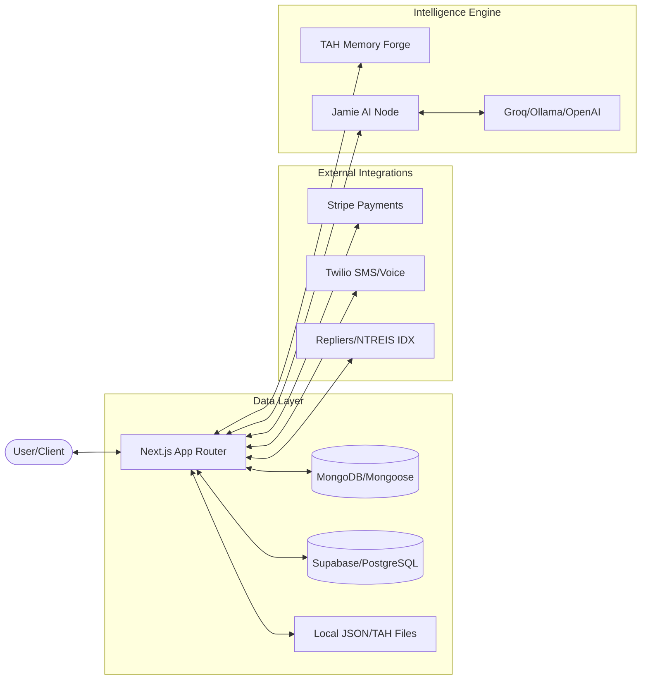
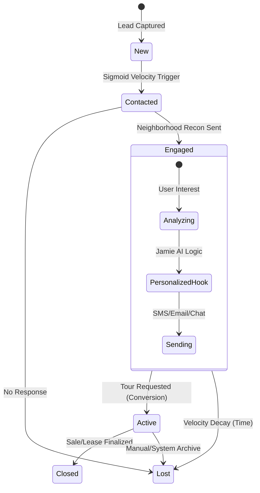
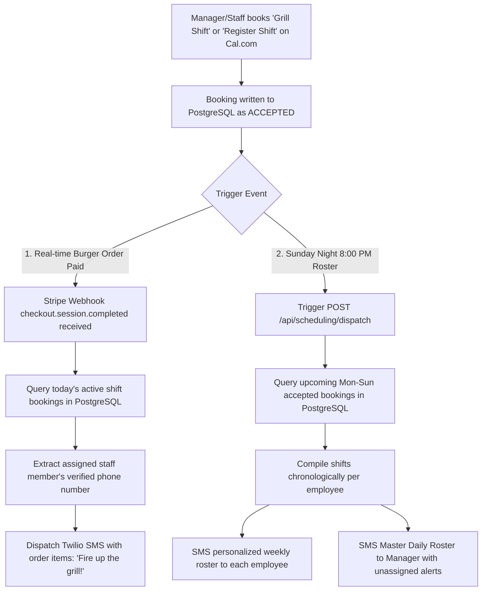

# Sunset Pulse

Sunset Pulse is a Next.js 15 real estate intelligence platform for property discovery, lead engagement, valuation workflows, and operational analytics. The application combines a customer-facing property experience with internal intelligence tools for market analysis, lead scoring, automation, and visual content workflows.

## Current Status

- **Status:** 🟢 Alpha Maturation // Supabase Hegemony
- **Application framework:** Next.js 14 App Router with React and TypeScript
- **Data services:** Supabase (Consolidated Property Grid), MongoDB, and local mock data.
- **Test coverage:** Vitest unit tests and Playwright browser tests.
- **Primary focus:** TAH Memory Forge, Sigmoid Lead Maturation, and Ozriel Protocol integration.

### 🏗️ System Architecture Overview



## Core Capabilities

- Property browsing, search, saved listings, and high-performance IDX sync via Repliers.io.
- Authenticated Matrix IDX access through `/idx` and the embedded Jamie tab MLS drawer.
- Hero news tabs and `/api/news` for lightweight local market/headline signals.
- Lead capture, re-engagement with Sigmoid velocity scoring, and Jamie AI hooks.
- Neighborhood Recon & Budget Delta analysis for hyper-personalized interactions.
- TAH Expertise retrieval (Makiel, Gadrael, etc.) from Supabase Cloud-Native storage.
- Visualization components for maps, 3D property views, and D3.js velocity trajectories.
- Command Center and JamieChat integration docs live in [`docs/AI_INTEGRATION_STACK.md`](./docs/AI_INTEGRATION_STACK.md).
- Operator-guarded Crawl4AI ingestion can turn approved regional sites, brokerage pages, and public-record URLs into a local lead-intelligence JSONL ledger.
- Novu-compatible notification workflows provide one trigger path for hot leads, staff operations, scheduling updates, and future in-app notifications.

### 📈 Lead Sigmoid Maturation Flow



## Technology Stack

- **Frontend:** Next.js, React, TypeScript, Tailwind CSS
- **Visualization:** Three.js, React Three Fiber, D3, Mapbox, Google Maps integrations
- **Data:** Supabase, MongoDB/Mongoose, local JSON fixtures, external real estate data adapters
- **Testing:** Vitest, Testing Library, Playwright
- **Payments and messaging:** Stripe, Twilio, Telegram integrations IAP WIP
- **Media workflows:** FFmpeg-oriented render pipeline, local visual assets, and segmentation support

## MLS / IDX Access

Sunset Pulse exposes MLS search through an authorized NTREIS Matrix IDX iframe:

- The standalone MLS route is `/idx`.
- `/idx` is server-gated with Supabase auth through `getSessionUser()`.
- Anonymous users are redirected to `/login?redirect=/idx`.
- Jamie's docked tab can also show the Matrix IDX iframe in-place through the `MLS` control.
- The Jamie MLS drawer does not change the user's current page.
- The Jamie MLS drawer renders the iframe only for authenticated users.
- Anonymous users see a login prompt inside Jamie instead of the MLS iframe.
- Jamie must not automatically navigate users to `/idx`; MLS access should be an explicit user action.

This keeps Matrix/IDX access close to the assistant while preserving a clear login boundary around listing data.

## TAH API

Sunset Pulse exposes the local cartridge brain through `/api/tah`:

- `GET /api/tah` returns endpoint status and the queryable cartridge catalog.
- `GET /api/tah?q=Dallas&limit=5` runs a quick cartridge search.
- `POST /api/tah` accepts `{ "query": "Dallas zoning", "limit": 10, "sync": false }`.
- `sync: true` attempts a Supabase cartridge sync before searching.
- `/api/tah/eval` remains the advanced S-expression evaluator for internal workflows.
- `GET /api/tah/master` inspects the local `atlas_pulse_master.hat/.tah` Memoria pair when it has been generated.
- `GET /api/tah/master/search?q=Atlas%20Pulse&limit=5` searches only the local master archive.
- `POST /api/tah/master/search` accepts `{ "query": "Deep Ellum", "limit": 5 }`.
- `GET /api/tah/master/sources` pages through the master archive provenance manifest.
- `GET /api/tah/master/places` extracts Atlas Pulse place bindings from the packed master payload.
- `/tah` and `/tah/[cartridge]` expose crawlable HTML context pages for robots and agents.
- `/tah/index.json` exposes a dynamic, machine-readable catalog rebuilt from the cartridge directories on request.
- `/tah/headless` and `/tah/[cartridge]/headless` expose plain-text scraper views with backend-oriented labels.
- `/llms.txt`, `/robots.txt`, and `/sitemap.xml` advertise the TAH archive as a stable context surface.
- `/tah` includes explicit AI-agent crawl guidance and preferred query patterns.
- Abidan judge context is routed through `lib/ai/brain/abidan_tah.ts`, which supports both indexed `.tah` cartridges and split Memoria `.hat`/`.tah` pairs before adding broad Pulse matches.
- `TAH_MEMORIA_V4_SPEC.md` defines the draft super-cartridge direction for packaging existing cartridges into a high-capacity, provenance-aware Memoria pair.
- `npm run tah:pack-master` packages the current cartridge catalog into a local `cartridges/master/atlas_pulse_master.hat/.tah` pair with a provenance manifest.
- `lib/core/memoria_v4.ts` contains the first Memoria v4 superblock and section-directory reader prototype.
- `/admin/orchestrator` is the local/operator control room for Telegram routing, model-network status, guarded tools, process grouping, and browser-style checks.
- `/api/admin/orchestrator/command` runs the same command router from the web console.
- `/api/admin/orchestrator/terminal-intents/[id]` approves, rejects, or runs queued terminal intents. Low-risk commands can run directly, medium-risk commands require approval first, and high-risk commands are manual-only.
- Queued terminal intents persist to `/.orchestrator/terminal-intents.json` by default. Set `ORCHESTRATOR_COMMAND_QUEUE_PATH` to move the local queue store.
- `/api/telegram/webhook` accepts Telegram updates, authorizes `AUTHORIZED_USER_ID` or `TELEGRAM_OPERATOR_CHAT_ID`, and routes `/commands`, `/status`, `/sessions`, `/tah`, `/places`, `/check`, `/cancel`, `/pack_master`, and guarded `!command` terminal intents.
- `/api/intelligence/crawl-lead` runs the operator-guarded Crawl4AI lead-intelligence ingestion path and writes local JSONL rows under `cartridges/lead-intel/` by default.
- `/api/notifications/novu` triggers or locally queues Novu-compatible notification workflows, starting with hot-lead alerts from the lead processor.

## 🗓️ Sunset Gas and Grill - Shift Scheduling & SMS Automation

Sunset Pulse features an advanced scheduling integration for **Sunset Gas and Grill** (open Monday–Saturday 5:00 AM – 10:00 PM, Sunday 6:00 AM – 9:00 PM). It bridges Stripe payments, Cal.com scheduled shift profiles, and Twilio SMS dispatches to keep the culinary and cash operations running smoothly.

### 🔄 The Operational Lifecycle (How it Syncs)



### 1. Real-time Order Webhook Routing
- **File:** `app/api/webhook/stripe/route.ts`
- **Mechanism:** On receiving a `checkout.session.completed` event containing metadata `orderType = grill_food`, the webhook queries PostgreSQL for accepted bookings matching the custom event type slugs `grill-shift` and `register-shift` active for the current calendar day.
- **Failover:** If no staff member is scheduled for a role, the SMS order alert falls back programmatically to the `FALLBACK_NOTIFICATION_PHONE` (the manager) to ensure no orders are missed.

### 2. Sunday Night Weekly Schedule SMS Dispatcher
- **File:** `app/api/scheduling/dispatch/route.ts`
- **Endpoint:** `POST /api/scheduling/dispatch` (Secure: Authorized via custom header `Authorization: Bearer <SCHEDULER_DISPATCH_SECRET>`).
- **Date Math:** Automatically isolates the upcoming Monday `00:00:00.000` to Sunday `23:59:59.999` local timezone boundaries. Supports customizable ranges via `weekOffset` payload parameters.
- **Master Digest:** Compiles a complete day-by-day weekly status roster and dispatches it directly to the manager. If a shift is empty for any day, it explicitly tags it with `⚠️ UNASSIGNED` as a proactive operational alert.

### 3. Cal.com Database Integration Setup
To align your scheduling database correctly, verify that:
1. Two booking **Event Types** are configured with slugs matching exactly:
   * **Grill Shift:** `grill-shift`
   * **Register Shift:** `register-shift`
2. Employee profiles have their primary mobile phone numbers entered and verified under their account profile so they map to the `verifiedNumbers` array in the database schema.

---

## Data Architecture & Caching Strategy

To support lightning-fast user interactions and fluid AI-agent background loops, Sunset Pulse leverages a sophisticated multi-layered caching and isolation strategy built directly on top of Next.js 14's App Router:

### 1. Server-Only Boundaries (`server-only`)
To strictly enforce security boundaries and prevent credential leakage, secure utility files (such as Twilio SMS configurations and Identity Gatekeepers) are wrapped with `import 'server-only'`. This creates an absolute build-time firewall, throwing compiler errors if any client-side components attempt to load server-exclusive logical branches.

### 2. Instant Static Layouts with Dynamic Pockets (Suspense Streaming)
By separating static structural grids (like navbars and structural layouts) from highly dynamic data queries, we ensure near-zero Time to First Byte (TTFB). Slow database calls (e.g., retrieving verified real estate assets) are decoupled into dedicated component streams wrapped in React `<Suspense>` boundaries. The shell serves instantly, and dynamic elements stream in as they resolve.

### 3. Granular Cache Invalidation (Tag-Based Revalidation)
While native fetch caches are straightforward, direct MongoDB or Supabase calls require custom handling. Direct database reads are wrapped inside Next.js's `unstable_cache` and assigned dynamic, hashed keys (incorporating user sessions and query parameters). This data is tagged globally (such as `bookmarks-${userId}` or `collections-${userId}`). Upon user mutation (like saving an asset or modifying a watchlist), the cache is purged instantly and on-demand using `revalidateTag()`.

### 4. NoSQL for the Agentic Age (The SunsetWars Paradigm)
> *Traditional SQL engines are ledger-first systems—rigidly structured for human operations. In the Agentic Age, autonomous AI agents operate dynamically, recursively, and at sub-millisecond intervals. They require an adaptable memory substrate to store intermediate reasoning, dynamic context, and rapidly-evolving operational states.*
>
> *By combining Supabase's structured relational persistence with MongoDB/Mongoose's fluid document schema, Sunset Pulse provides a hybrid memory engine. This gives our autonomous agents (like Jamie) the ultra-low latency, schema-less canvas they need to learn, evaluate, and act independently.*

## Getting Started

Install dependencies:

```bash
npm install
```

Start the development server:

```bash
npm run dev
```

Start the development server with mock-mode data integrations:

```bash
npm run dev:mock
```

Open the application at `http://localhost:3000`.

## Environment Configuration

The application can run with partial configuration for local UI work, but production-like workflows require service credentials.

Use `NEXT_PUBLIC_MOCK_MODE=true` when running local tests or development flows that should avoid live data providers.

## News Signals

Sunset Pulse includes a lightweight news feature used by the home-page hero tabs and the `/api/news` feed.

- `GET /api/news` serves the current headline packet used by the UI.
- The preferred source is the latest local-machine signal stored in Supabase via `lib/news/signalStore.ts`.
- Local signals are published by `scripts/publish-local-news-signals.ts`, which fetches RSS headlines and optionally enriches them with locally installed Ollama mini models.
- The protected ingest endpoint is `POST /api/news/signals`, authorized with `NEWS_SIGNAL_SECRET` or `LOCAL_NEWS_SIGNAL_SECRET`.
- If no local signal is available, `/api/news` falls back to Google News RSS through `lib/news/rssFeed.ts`.
- If local Ollama mini models are available during fallback generation, `lib/news/ollamaMini.ts` can enrich the RSS items before they are returned.
- The public article expansion page is `/news/tah`, which turns a selected headline into a TAH-style story view.

This keeps production lightweight: Ollama runs only on the local Windows machine, while Vercel receives compact signed packets and serves the latest accepted packet. See [Local Ollama News Signals](./docs/LOCAL_NEWS_SIGNALS.md) for env vars, the publisher script, and Task Scheduler setup.

## Testing

Run the Vitest unit suite:

```bash
npm run test:unit
```

Run the Playwright browser suite:

```bash
npm run test:e2e
```

The Playwright configuration excludes `tests/unit` so Vitest-specific files are not loaded by the browser test runner. The Playwright web server also starts with `NEXT_PUBLIC_MOCK_MODE=true` to reduce dependence on live provider availability during local test runs.

## Build

Create a production build:

```bash
npm run build
```

Start the production server after building:

```bash
npm run start
```

## Project Structure

- `app/` - Next.js routes, API handlers, and page-level modules
- `components/` - Shared UI, property, admin, visualization, and workflow components
- `lib/` - Core business logic, data adapters, AI workflows, security utilities, and visualization engines
- `hooks/` - Reusable React hooks for properties, telemetry, studio workflows, and intelligence features
- `models/` - Mongoose models and domain entities
- `tests/` - Playwright specs and Vitest unit tests
- `scripts/` - Operational scripts, data seeding, sync tools, and verification utilities
- `supabase/` - Supabase migrations and edge functions
- `public/` - Static assets, images, models, audio, and videos

## Development Notes

- Keep live-service integrations behind environment checks or mock-mode fallbacks where practical.
- Prefer focused unit tests for deterministic business logic and Playwright tests for user-facing workflows.
- Keep README updates factual and operational so new contributors can understand the system without needing internal shorthand.

## License

See [LICENSE.md](./LICENSE.md).

SunsetPulse 2026
