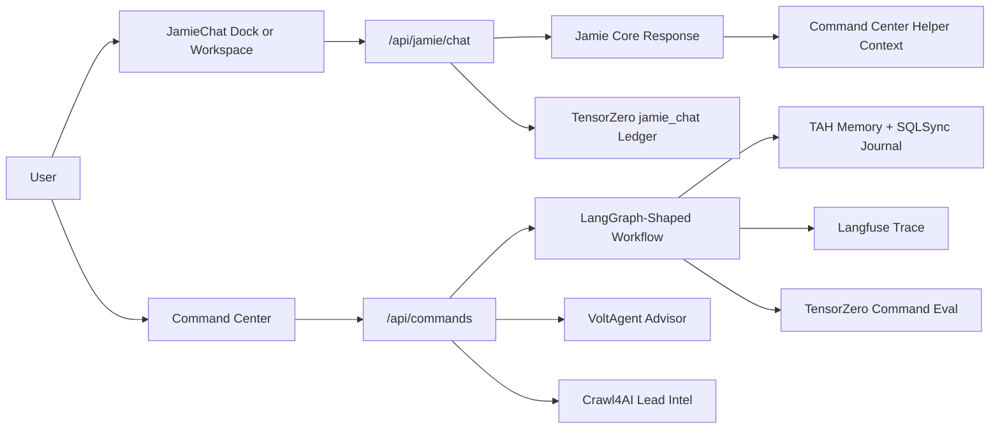

# AI Integration Stack

This document summarizes the AI and geospatial integrations added around the Command Center and JamieChat workstream. It is the quick map for future implementation passes.

## Primary Surfaces

| Surface | Route | Purpose |
| --- | --- | --- |
| Command Center | `/command-center` | Routes agent commands to specialized TAH workers, relay templates, memory, and provenance. |
| JamieChat dock | global widget | Lightweight assistant surface for property and workflow help. |
| JamieChat workspace | `/jamie-chat` | Maximized assistant-ui chat surface paired with the Command Center. |
| Kepler Spatial Lab | `/spatial-lab` | Exploratory geospatial workbench for listing signals. |
| deck.gl Signal Map | `/spatial-lab/deck` | App-native geospatial layer surface for productized map features. |
| Lead Intelligence Crawler | `/api/intelligence/crawl-lead` | Operator-guarded Crawl4AI ingestion route for regional sites, brokerages, and public records. |

## Runtime Stack

| Integration | Current Role | Main Files |
| --- | --- | --- |
| LangGraph-shaped workflow | Command Center stage graph for route, retrieve, plan, synthesize, supervise, remember, respond. Uses a local linear adapter to avoid the current LangGraph package barrel export issue during Next builds. | `apps/pulse/lib/command-center/commandRouter.ts`, `apps/pulse/lib/compat/langgraphLinear.ts` |
| Langfuse | Redacted Command Center tracing when Langfuse env vars are configured. | `apps/pulse/lib/observability/langfuseTracing.ts` |
| VoltAgent | Optional typed advisor beside the Command Center route. | `apps/pulse/lib/agents/voltagentCommandAdvisor.ts`, `apps/pulse/app/api/agents/voltagent/command-advisor/route.ts` |
| SQLSync-ready journal | Local JSONL mutation contract for query memory and action clicks. | `apps/pulse/lib/sqlsync/commandJournal.ts`, `apps/pulse/app/api/sqlsync/command-journal/route.ts` |
| TensorZero-ready ledgers | Local evaluation and feedback rows for command runs, actions, and JamieChat turns. | `apps/pulse/lib/tensorzero/*`, `apps/pulse/tensorzero/tensorzero.toml` |
| assistant-ui | Maximized JamieChat runtime and UI primitives. | `apps/pulse/components/chat/JamieAssistantWorkspace.tsx`, `apps/pulse/app/jamie-chat/page.tsx` |
| Kepler.gl | Analyst-oriented spatial workbench. | `apps/pulse/components/spatial/KeplerSpatialLab.tsx` |
| deck.gl | Product-native signal map layers. | `apps/pulse/components/spatial/DeckListingSignals.tsx` |
| Crawl4AI | Local-first lead intelligence crawler that converts approved URLs to Markdown and compact JSON. | `apps/pulse/lib/lead-intel/crawlLead.ts`, `apps/pulse/app/api/intelligence/crawl-lead/route.ts`, `apps/pulse/workers/lead-intel-crawler/crawl4ai_worker.py` |

## Request Flow



## Privacy And Local Data

Local ledgers are intentionally compact and avoid raw command or chat text.

- Query memory stores local `.tah` summaries and source references.
- SQLSync-ready rows store reducer names, primary keys, and compact payloads.
- TensorZero-ready rows store fingerprints, ids, variant names, counts, route metadata, tool names, grounding flags, and scores.
- Langfuse traces store stage metadata and counts, not long source excerpts or generated copy.
- Crawl4AI lead-intel rows store operator-approved source URLs, compact metadata, capped Markdown, and compact JSON signals in a local JSONL ledger.

Ignored local outputs:

```text
apps/pulse/cartridges/sqlsync/*.jsonl
apps/pulse/cartridges/tensorzero/*.jsonl
apps/pulse/cartridges/lead-intel/*.jsonl
apps/pulse/cartridges/query_memory.tah
```

## Environment Flags

```bash
LANGFUSE_PUBLIC_KEY=
LANGFUSE_SECRET_KEY=
LANGFUSE_BASE_URL=https://us.cloud.langfuse.com

VOLTAGENT_COMMAND_ADVISOR_ENABLED=true
VOLTAGENT_COMMAND_MODEL=groq/llama-3.1-8b-instant

PULSE_SQLSYNC_CLIENT_ID=sunset-pulse-local
PULSE_SQLSYNC_JOURNAL_DISABLED=false
PULSE_SQLSYNC_JOURNAL_PATH=

TENSORZERO_PROJECT_NAME=sunset-pulse
TENSORZERO_GATEWAY_URL=
TENSORZERO_COMMAND_EVAL_DISABLED=false
TENSORZERO_COMMAND_EVAL_PATH=
TENSORZERO_FEEDBACK_DISABLED=false
TENSORZERO_FEEDBACK_PATH=
TENSORZERO_JAMIE_CHAT_DISABLED=false
TENSORZERO_JAMIE_CHAT_PATH=

LEAD_INTEL_CRAWLER_DISABLED=false
LEAD_INTEL_ALLOWED_DOMAINS=example.com
LEAD_INTEL_ALLOW_UNLISTED=false
LEAD_INTEL_TRUST_REQUEST_ALLOWLIST=false
LEAD_INTEL_PYTHON=python
LEAD_INTEL_WORKER_PATH=
LEAD_INTEL_LEDGER_PATH=
```

## Validation

Use these checks after changing this stack:

```bash
npm run test:unit --workspace=apps/pulse -- tests/unit/command-center.test.ts
npm run test:unit --workspace=apps/pulse -- tests/unit/lead-intel-crawl.test.ts
npx tsc -p apps/pulse/tsconfig.json --noEmit --pretty false
npm run build --workspace=apps/pulse
```

Known build warnings:

- `@voltagent/core` emits a dynamic dependency warning.
- Kepler/Redux emits minified-code warnings outside `NODE_ENV=production`.

Both warnings are currently non-blocking.

## Next Passes

- Route selected Jamie workspace commands directly into `/api/commands` as explicit assistant actions.
- Replace `apps/pulse/lib/compat/langgraphLinear.ts` with the upstream `@langchain/langgraph` import after the package export issue is resolved.
- Map local TensorZero JSONL rows to a live TensorZero Gateway.
- Add OpenLIT or OpenTelemetry-native tracing once the current Langfuse/TensorZero split is stable.
