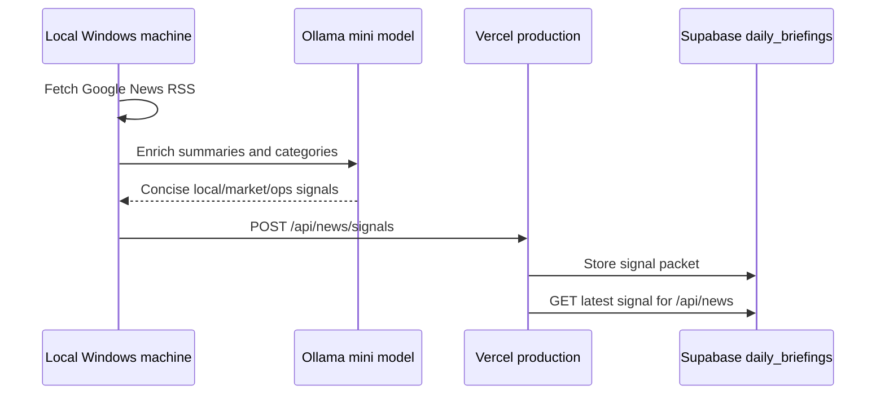

# Local Ollama News Signals

Sunset Pulse can keep production lightweight by letting the local Windows machine gather and enrich news with Ollama mini models, then push a compact signal packet to Vercel on a schedule.

## Flow



The local machine is the only place that needs Ollama. Production accepts signed signal packets and serves the latest accepted packet from `/api/news`.

## Files

- `lib/news/rssFeed.ts`: fetches and parses RSS items.
- `lib/news/ollamaMini.ts`: detects local Ollama manifests and enriches RSS items.
- `lib/news/signalStore.ts`: normalizes and stores accepted signals in `daily_briefings`.
- `app/api/news/signals/route.ts`: protected production ingest/read endpoint.
- `app/api/news/route.ts`: serves the latest local signal first, then falls back to RSS.
- `scripts/publish-local-news-signals.ts`: local publisher used by npm and Task Scheduler.
- `scripts/start-local-news-signals.ps1`: Task Scheduler target.
- `scripts/register-local-news-signals-task.ps1`: registers a repeating 30-minute Windows task.

## Environment

Set the same secret locally and in Vercel:

```env
NEWS_SIGNAL_SECRET=replace-with-a-long-random-secret
```

Set these locally on the Windows machine:

```env
NEWS_SIGNAL_TARGET_URL=https://your-production-vercel-url.vercel.app
NEWS_OLLAMA_MODEL=phi4-mini:latest
```

Optional:

```env
NEWS_REMOTE_SIGNALS_ENABLED=true
NEWS_OLLAMA_ENABLED=true
OLLAMA_HOST=http://127.0.0.1:11434
OLLAMA_LIBRARY_MANIFESTS=C:\Users\Taz\.ollama\models\manifests\registry.ollama.ai\library
```

`ollamaMini.ts` defaults to this manifest directory:

```text
C:\Users\Taz\.ollama\models\manifests\registry.ollama.ai\library
```

Model selection prefers `phi4-mini`, then `smollm2`, then `gemma4`. Set `NEWS_OLLAMA_MODEL` to override.

## Manual Publish

From `apps/pulse`:

```powershell
npm run news:publish-local
```

The script writes a local snapshot to:

```text
utils/jamie/memory/local_news_signal.json
```

If Ollama is not running, the script still publishes the RSS-backed signal and marks the mini status as `failed`.

## Scheduled Publish

From `apps/pulse`:

```powershell
powershell -ExecutionPolicy Bypass -File .\scripts\register-local-news-signals-task.ps1
```

This registers `SunsetPulse Local News Signals`, which runs every 30 minutes.

Logs:

```text
scripts/logs/local-news-signals.out.log
scripts/logs/local-news-signals.err.log
```

## Production Behavior

`GET /api/news` checks Supabase for the latest local signal first.

If a signal exists, the response includes:

```json
{
  "provider": "local-ollama-news+rss",
  "source": "local-machine-signal",
  "articles": []
}
```

If no signal exists, production falls back to regular RSS parsing. Set `NEWS_REMOTE_SIGNALS_ENABLED=false` to skip the Supabase signal read.

## Security

`POST /api/news/signals` requires:

```http
Authorization: Bearer <NEWS_SIGNAL_SECRET>
```

Do not expose `NEWS_SIGNAL_SECRET` through `NEXT_PUBLIC_*` variables.
